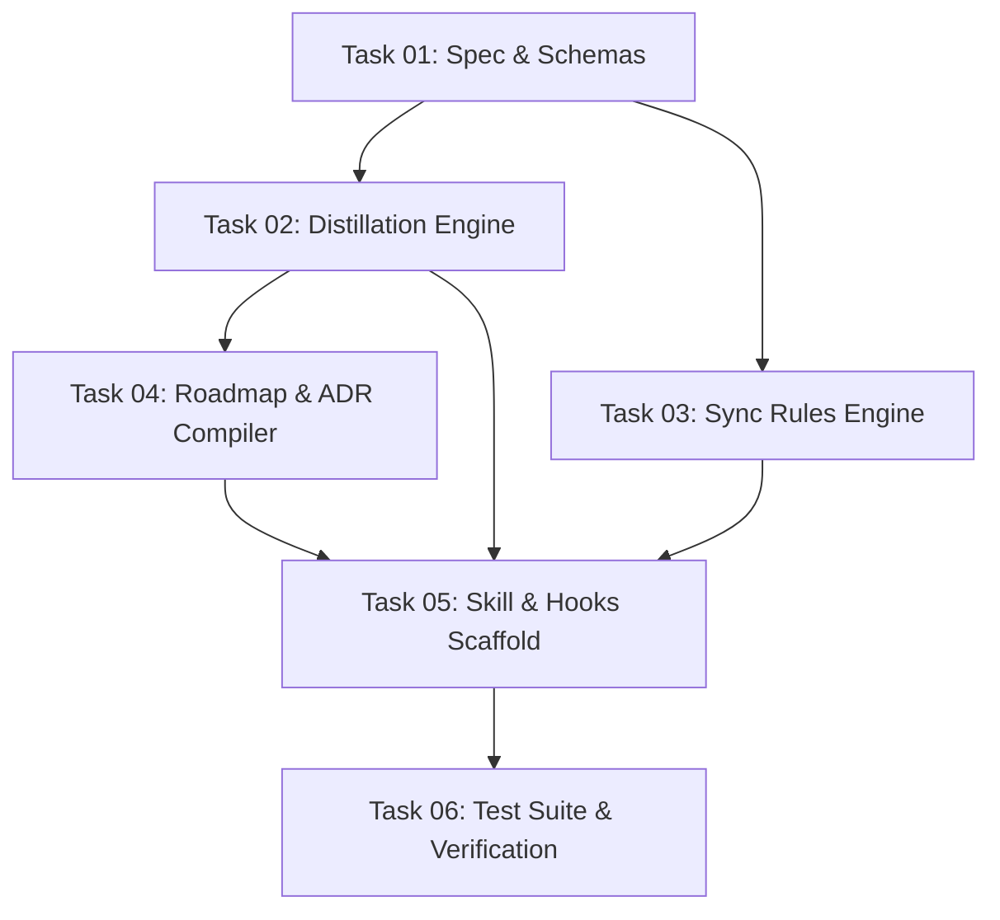

# PRMT-E94A: Orchestration & Execution Runbook

## Objective
Build and deploy the `continuous-alignment` skill into `agent-skill-forge` and configure project hooks to keep `AGENTS.md`, `.agents/rules/*.md`, `docs/VISION.md`, and `.gemini/knowledge/ADRs/` perpetually in sync with active engineering development.

---

## Execution Flow (DAG Sequence)

1. **Step 1: Protocol & Schema Foundation (`task_01_spec_and_schemas`)**
   - Create schemas for extracted memory entries, rule classifications, and hook inputs.
2. **Step 2: Engine Implementation (`task_02_distillation_engine` & `task_03_sync_rules_engine`)**
   - Implement transcript parser, regex/AST extractor, confidence scorer, and line budget allocator.
3. **Step 3: Roadmap & ADR Integration (`task_04_roadmap_vision_compiler`)**
   - Implement milestone tracker and MADR template generator.
4. **Step 4: Skill & Hooks Configuration (`task_05_skill_and_hooks_scaffold`)**
   - Scaffold `skills/continuous-alignment/SKILL.md` and `.agents/hooks.json`.
5. **Step 5: Verification & Sync (`task_06_test_suite_and_validation`)**
   - Run unit tests and execute `scripts/validate_skills.py`.
