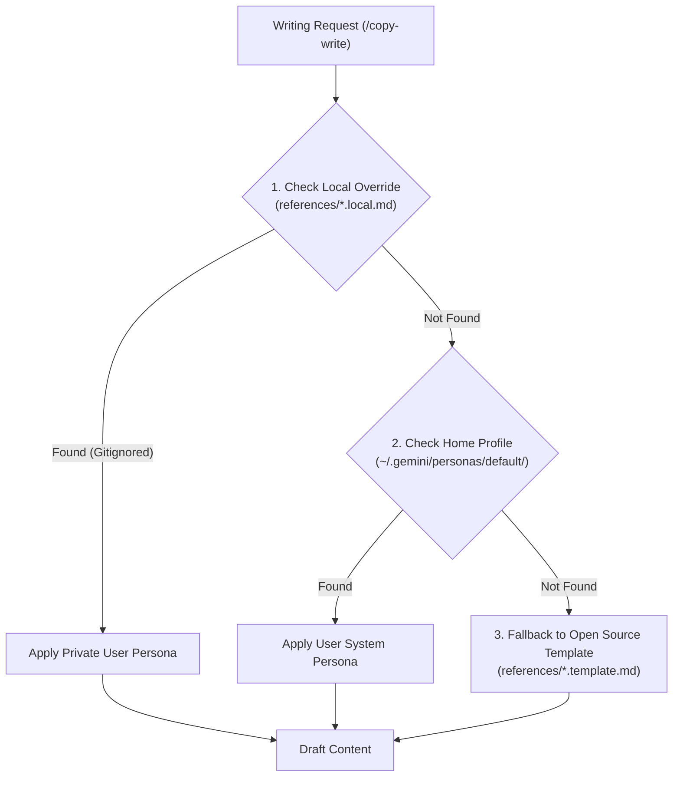

# 🏛️ Monorepo Architecture & Design

## 🌟 The 2-Tier Skill Architecture

Agent Skill Forge splits skills into two distinct tiers:

```
┌────────────────────────────────────────────────────────────────────────┐
│                        TIER 1: GLOBAL LIFECYCLE                        │
│   prompt · grill · spec · plan · test · verify · review · unslop       │
│   docs · catalog · sync · google-oss · codelab · voice · copy-write    │
│   image-gen                                                            │
└──────────────────────────────────┬─────────────────────────────────────┘
                                   │
                                   ▼ On-Demand JIT Bootstrap
┌────────────────────────────────────────────────────────────────────────┐
│                      TIER 2: PROJECT-SCOPED DOMAIN                     │
│   frontend-ui · perf-opt · api-design · security · migrations · devtools│
│   observability · ci-cd · debugging · git-workflow · context · bench   │
└────────────────────────────────────────────────────────────────────────┘
```

### Why This Matters:
1. **Token Window Economy**: Modern LLM agents inject active skill descriptions into their system prompts on every turn. Restricting global scope to 15 core verbs keeps token consumption minimal and latency low.
2. **Elimination of Keyword Collisions**: Clear 1-word verbs eliminate ambiguity between similar commands.
3. **Domain Purity**: A backend Python microservice doesn't need CSS `:has()` rules in its agent context, and a frontend Next.js app doesn't need PostgreSQL WAL tuning instructions.

---

## 🛡️ Profile-Overlay Personalization


