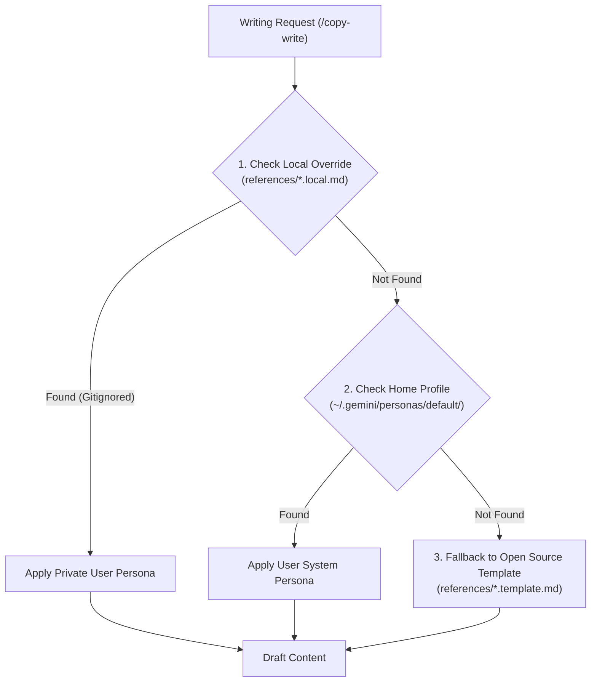
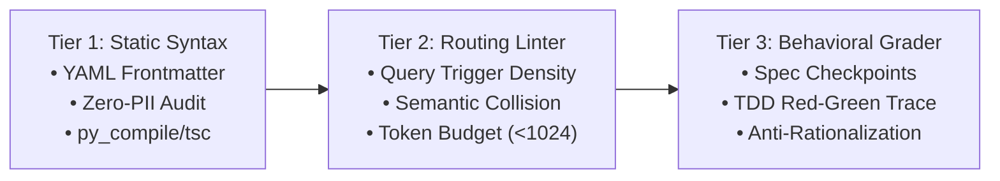

# 🏛️ Monorepo Architecture & Design

Comprehensive architectural specifications for **Agent Skill Forge**, detailing the 2-tier scoping engine, cross-platform compatibility layers, multi-agent fan-out orchestration, and evaluation harnesses.

---

## 🌟 1. The 2-Tier Skill Architecture

Agent Skill Forge splits skills into two distinct tiers to balance discovery speed with context window conservation:

```
┌────────────────────────────────────────────────────────────────────────┐
│                        TIER 1: GLOBAL LIFECYCLE                        │
│   prompt · grill · spec · plan · test · verify · review · unslop       │
│   docs · catalog · sync · google-oss · codelab · voice · copy-write    │
│   image-gen                                                            │
└──────────────────────────────────┬─────────────────────────────────────┘
                                   │
                                   ▼ On-Demand JIT Bootstrap
┌────────────────────────────────────────────────────────────────────────┐
│                      TIER 2: PROJECT-SCOPED DOMAIN                     │
│   frontend-ui · perf-opt · api-design · security · migrations · devtools│
│   observability · ci-cd · debugging · git-workflow · context · bench   │
└────────────────────────────────────────────────────────────────────────┘
```

### Architectural Benefits:
1. **Token Window Economy**: Modern LLM agents inject active skill descriptions into their system prompts on every turn. Restricting global scope to 16 core verbs keeps token overhead minimal ($\le 800$ tokens total) and inference latency low.
2. **Elimination of Semantic Collisions**: Clear, distinctive 1-word verbs eliminate intent ambiguity between overlapping commands.
3. **Domain Purity**: A backend Python microservice doesn't need CSS `:has()` rules in its agent context, and a frontend Next.js app doesn't need PostgreSQL WAL tuning instructions.

---

## 🔌 2. Cross-Platform Interoperability Engine

Skills in Agent Skill Forge conform to the universal `SKILL.md` frontmatter standard, enabling seamless multi-runtime operation without file duplication:

| Runtime Environment | Discovery Mechanism | Skill Directory | Policy Location |
| :--- | :--- | :--- | :--- |
| **Google Antigravity IDE** | Skills Hub & Customizations | `~/.gemini/config/skills/` | `.gemini/rules/` / Global Rules |
| **Claude Code** | Native Plugin Manifest (`plugin.json`) | `~/.claude/skills/` | `CLAUDE.md` |
| **Gemini CLI** | Workspace Skills Hub | `~/.gemini/skills/` | `GEMINI.md` |
| **Cursor IDE** | Cursor Agent Auto-Discovery | `.cursor/skills/<name>/SKILL.md` | `.cursor/rules/*.mdc` |
| **OpenAI Codex / Operator** | Codex Marketplace Plugin | `~/.codex/plugins/` or `.codex-plugin/` | `AGENTS.md` |
| **OpenCode / Windsurf** | Open Agent Standard Hub | `~/.agents/skills/` | `AGENTS.md` |

---

## 🛡️ 3. Profile-Overlay Personalization



---

## 🧪 4. 3-Tier Evaluation & Verification Harness



---

## 🧠 5. Open Knowledge Format (OKF) Subsystem

Architectural memory is maintained under [`.gemini/knowledge/`](file:///Users/ksprashanth/code/github/agent-skill-forge/.gemini/knowledge/index.md) across 5 specialized subtrees:
- **`scout/`**: Codebase topology, skill directory, ecosystem landscape.
- **`analyst/`**: Design decisions, attribution matrix, comparative benchmarks, leading words linguistics.
- **`architecture/`**: Frontmatter schemas, installer specs, compiler pipelines, orchestration catalogs.
- **`builder/`**: Runbooks, authoring handbooks, Socratic grilling engines.
- **`sentry/`**: Zero-PII policies, OSS compliance, 3-tier eval harnesses, anti-rationalization guardrails.
