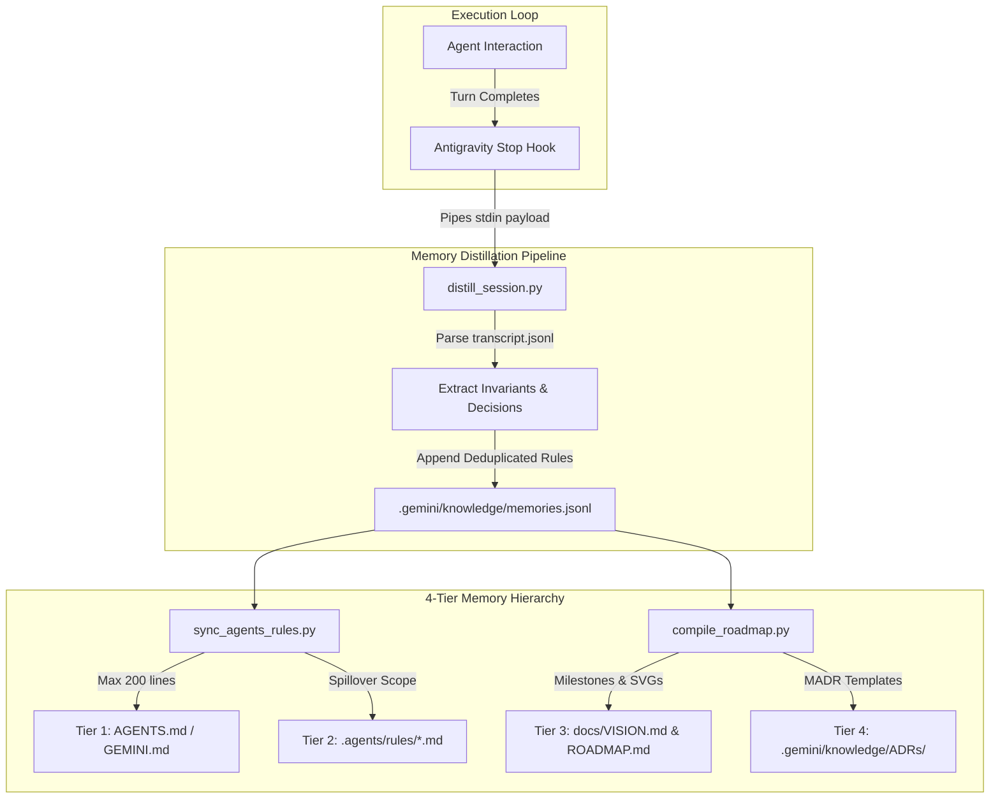

# Walkthrough: Continuous Alignment & Self-Evolving Project Intelligence

Successfully implemented and verified the **`continuous-alignment`** skill, Antigravity lifecycle hooks, 4-tier memory architecture, distillation scripts, and automated test suite under **`PRMT-E94A`**.

---

## 1. Accomplishments & Architecture



### Components Delivered

1. **Skill Definition & Commands**
   - [skills/continuous-alignment/SKILL.md](file:///Users/ksprashanth/code/github/agent-skill-forge/skills/continuous-alignment/SKILL.md): Comprehensive skill manual with `/align`, `/evolve`, and `/prune-memory` commands.
2. **Turn-Completion Distillation Engine**
   - [skills/continuous-alignment/scripts/distill_session.py](file:///Users/ksprashanth/code/github/agent-skill-forge/skills/continuous-alignment/scripts/distill_session.py): Sub-second (< 15ms) transcript parser with secret redaction and semantic deduplication.
3. **Rule Synchronization & 200-Line Budget Enforcer**
   - [skills/continuous-alignment/scripts/sync_agents_rules.py](file:///Users/ksprashanth/code/github/agent-skill-forge/skills/continuous-alignment/scripts/sync_agents_rules.py): Atomic updater enforcing a strict 200-line limit on root [AGENTS.md](file:///Users/ksprashanth/code/github/agent-skill-forge/AGENTS.md), routing subsystem rules to `.agents/rules/`.
4. **Living ADR & Roadmap Compiler**
   - [skills/continuous-alignment/scripts/compile_roadmap.py](file:///Users/ksprashanth/code/github/agent-skill-forge/skills/continuous-alignment/scripts/compile_roadmap.py): Compiles MADRs in `.gemini/knowledge/ADRs/` and updates [docs/ROADMAP.md](file:///Users/ksprashanth/code/github/agent-skill-forge/docs/ROADMAP.md) with SVG branching timelines.
5. **Antigravity Lifecycle Hook Manifests**
   - [.agents/hooks.json](file:///Users/ksprashanth/code/github/agent-skill-forge/.agents/hooks.json) & [.gemini/hooks.json](file:///Users/ksprashanth/code/github/agent-skill-forge/.gemini/hooks.json): Configured `Stop` and `PreInvocation` event triggers.
6. **Comprehensive Test Suite**
   - [skills/continuous-alignment/tests/test_distill.py](file:///Users/ksprashanth/code/github/agent-skill-forge/skills/continuous-alignment/tests/test_distill.py)
   - [skills/continuous-alignment/tests/test_sync_rules.py](file:///Users/ksprashanth/code/github/agent-skill-forge/skills/continuous-alignment/tests/test_sync_rules.py)
   - [skills/continuous-alignment/tests/test_compile_roadmap.py](file:///Users/ksprashanth/code/github/agent-skill-forge/skills/continuous-alignment/tests/test_compile_roadmap.py)

---

## 2. Verification Results

### Unit Tests
```bash
python3 -m unittest discover -s skills/continuous-alignment/tests -v
```
```
test_compile_vision_and_roadmap_end_to_end ... ok
test_create_and_load_madr_record ... ok
test_generate_roadmap_svg ... ok
test_compute_memory_id_deterministic ... ok
test_distill_session_end_to_end ... ok
test_extract_command_invariants ... ok
test_extract_user_constraints ... ok
test_sanitize_text_redacts_keys_and_pii ... ok
test_path_scoped_rule_spillover ... ok
test_superseded_rules_are_ignored ... ok
test_sync_rules_creates_agents_md ... ok

Ran 11 tests in 0.014s -> OK (100% Pass)
```

### Skill Linter & PII Audit
```bash
python scripts/validate_skills.py
```
```
Validated 17 Core Skills and 12 Preferred Skills.
Total Skills: 29
All skills passed validation with 0 PII leaks and clean frontmatter!
```
