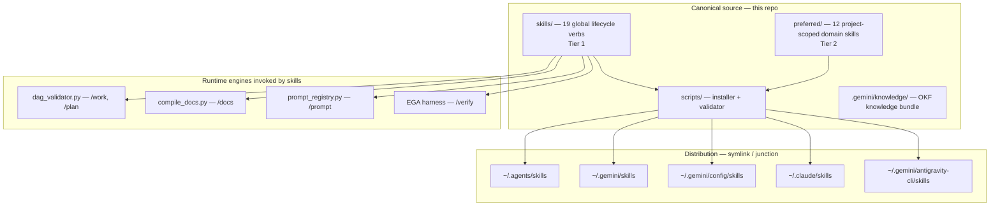
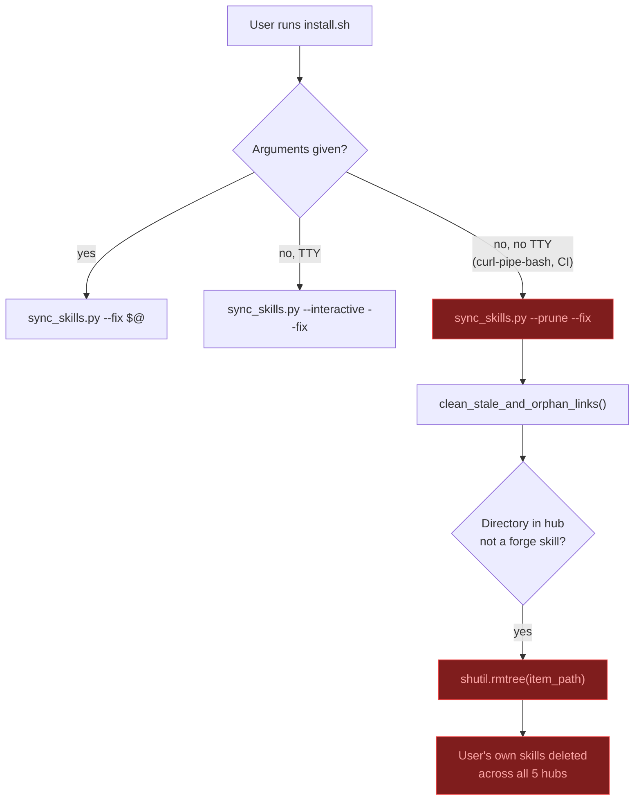
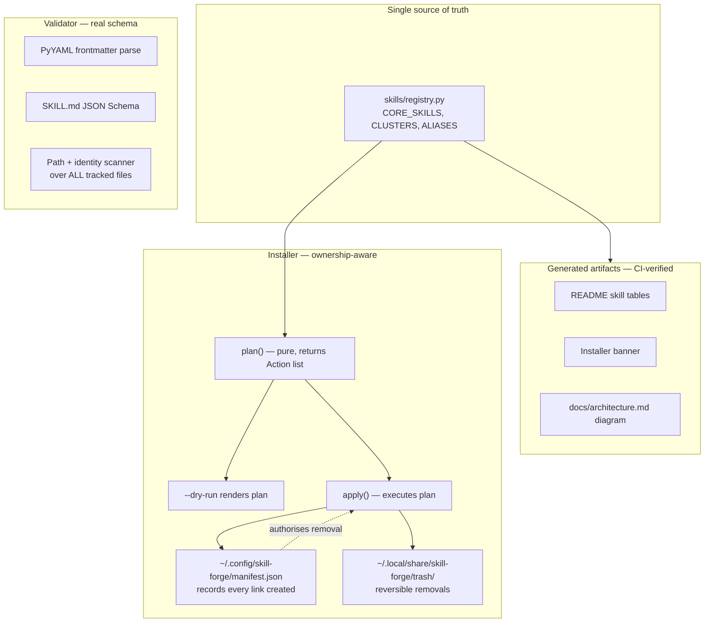
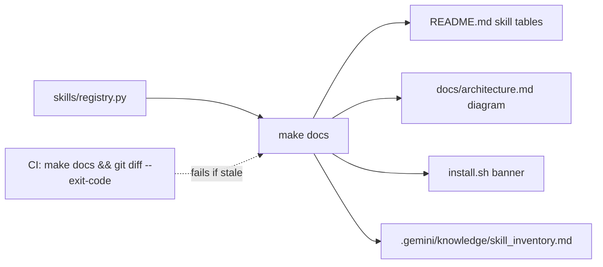

# Agent Skill Forge — As-Is / To-Be Architecture Review

| | |
|---|---|
| **Review date** | 2026-09-18 |
| **Commit reviewed** | `d381f7f` (`feat(installer): add skill clusters and selective installation support`) |
| **Scope** | Specification, design/architecture, and code quality across the whole repository |
| **Method** | Static read of source + docs, targeted greps, live execution of the three test suites and `validate_skills.py` |
| **Changes made to the repo** | None. This review was read-only; this document is the only artifact produced. |

---

## 1. How to read this document

Section 3 (**As-Is**) describes the system as it exists today — what it is meant to do, how it actually works, what holds up, and what is broken. Every defect carries a stable ID (`F-01` … `F-19`) and a file/line citation so it can be checked independently.

Section 4 (**To-Be**) describes the target design. It is deliberately written as a *design*, not a patch list: several findings share one root cause, and fixing them individually would leave the same class of bug available to the next contributor.

Section 5 traces every finding to the to-be change that closes it. Section 6 sequences the work.

Nothing here requires accepting the whole thing. The sections are independent; §6 Phase 0 alone removes the data-loss risk.

---

## 2. Executive summary

Agent Skill Forge is a multi-runtime "skills" monorepo: one canonical set of Markdown skill definitions, distributed by symlink into five different AI coding tools (Claude Code, Gemini CLI, Antigravity, Cursor/Codex, OpenCode/Windsurf). On top of that sits a Markdown-DAG workflow engine that drives the `/work` and `/plan` skills.

**The core engineering is sound in exactly the place you would hope and unsound in exactly the place you would not.**

- The **DAG engine** (`skills/work/scripts/dag_validator.py`) is well-structured and genuinely well-tested — 148 tests pass, including 77 end-to-end cases and a dedicated adversarial-hardening suite. Parse, validate, and render are cleanly separated. It has real bugs, but they are ordinary bugs in well-made code.
- The **installer** (`scripts/sync_skills.py`, `install.sh`, `install.ps1`) is the only component that deletes files from a user's machine, is the component a stranger runs first, and has **zero tests**. It currently defaults to a mode that recursively deletes directories it did not create, in five directories that belong to the user.
- The **validator** (`scripts/validate_skills.py`) is advertised as a frontmatter linter and PII scanner. It reports "0 PII leaks" while 49 tracked files contain the author's home-directory path.

The distance between the project's claims and its behaviour is the theme. The to-be design closes that distance structurally — by deriving claims from code rather than restating them in prose, and by making destructive operations provably scoped.

**Overall health**

| Area | As-is | Confidence |
|---|---|---|
| DAG engine correctness | 🟡 Good design, 3 real bugs | High — read in full, tests run |
| Installer safety | 🔴 Data-loss defects, untested | High — read in full |
| Validator fitness | 🔴 Does not detect what it claims | High — read in full, run live |
| Automation safety (`verify`, `work`) | 🔴 Shell injection + unprompted `git push` | High |
| Spec ↔ implementation agreement | 🔴 Skill count stated 6 different ways | High |
| Test coverage | 🟡 Excellent for 1 component, absent for the rest | High |
| Repo hygiene | 🟡 Conflict marker on the landing page; path leaks | High |

---

## 3. As-Is

### 3.1 What the system is



**Tier 1 / Tier 2 split.** Tier 1 skills are single-word action verbs (`plan`, `spec`, `test`, `review`, `work`, …) installed globally so they are always available. Tier 2 skills are domain-specific (`preferred/`) and bootstrapped into a project on demand. The stated rationale — token-window economy, since every global skill description is injected into the system prompt each turn — is sound and is the strongest design decision in the repo.

**Distribution model.** One canonical directory per skill, linked (not copied) into five hubs, so an edit to the source is live everywhere immediately. Also sound. The failure is entirely in the *lifecycle management* of those links, not the model.

### 3.2 Component inventory

| Component | Path | LOC | Tests | Risk |
|---|---|---|---|---|
| Installer / link manager | `scripts/sync_skills.py` | 651 | **0** | 🔴 Critical |
| POSIX installer wrapper | `scripts/install.sh` | 63 | 0 | 🔴 Critical |
| Windows installer wrapper | `scripts/install.ps1` | 46 | 0 | 🔴 High |
| Skill linter / PII scanner | `scripts/validate_skills.py` | 191 | 0 | 🟠 Medium |
| DAG engine | `skills/work/scripts/dag_validator.py` | 1033 | **✅ 137** | 🟡 Medium |
| EGA closure engine | `skills/verify/scripts/ega_closure_engine.py` | — | 0 | 🔴 Critical |
| EGA controller | `skills/verify/scripts/ega_controller.py` | — | 0 | 🟠 Medium |
| Forensic audit | `skills/work/scripts/forensic_audit.py` | — | 0 | 🟠 Medium |
| Arbiter eval | `skills/work/scripts/arbiter_eval.py` | — | 0 | 🟠 Medium |
| Docs compiler | `skills/docs/scripts/compile_docs.py` | 821 | 0 | 🟡 Unassessed |
| Prompt registry | `skills/prompt/scripts/prompt_registry.py` | 792 | 0 | 🟡 Unassessed |
| Continuous alignment | `skills/continuous-alignment/scripts/*` | — | ✅ 11 | 🟢 Low |
| Duplicate installer fork | `skills/sync/scripts/sync_skills.py` | ~12 KB | 0 | 🟠 Medium |

Of 22 scripts under `skills/*/scripts/`, **4 have tests**. The four that do are the four with the least destructive power.

### 3.3 Flow A — Installation (the highest-risk path)



The red path is the documented one-liner install.

### 3.4 Flow B — `/work` DAG execution

```mermaid
graph LR
    A["PROJECT.md<br/>Markdown task table"] --> B["parse_markdown()"]
    B --> C["validate_dependencies()"]
    C --> D["validate_artifact_paths()"]
    D --> E["validate_state_consistency()"]
    E --> F["detect_cycle_3color()"]
    F --> G["topological_sort_kahn()"]
    G --> H["compute_ready_frontier()"]
    H --> I["generate_mermaid()"]
    I --> J["update_markdown_content()<br/>in-place write"]
```



Well-factored. Two structural problems, both visible in this diagram:

1. `update_markdown_content` is called by `main()` **before** `validate()`, so step J happens before steps C–G.
2. `gate` and `mode` are parsed in step B and rendered in step I, but no step between them reads either field.

### 3.5 What currently holds up

Worth recording, so remediation doesn't regress it:

- **All 148 tests pass.** 60 unit (`skills/work/tests`), 77 e2e (`tests/e2e`), 11 continuous-alignment. Fast (<1s for unit).
- **`.gitignore` is correct.** No `__pycache__`, `.pyc`, `.DS_Store`, or `*.local.md` is tracked. The documented privacy guarantee for `*.local.md` profile overlays genuinely holds.
- **Frontmatter is consistent.** All 31 `SKILL.md` files have `name` and `description`. No malformed files.
- **`_split_table_row` handles escaped pipes correctly**, and the round-trip through `update_markdown_content` preserves `\|` without corruption.
- **Cycle detection is correct.** The 3-colour DFS, including the `current_path` maintenance and the self-loop short-circuit, is right.
- **Path-traversal defence in `validate_artifact_paths` is real** — it rejects absolute paths, Windows drive letters, `..` segments, and verifies containment via `os.path.commonpath`.
- **`secure_run_iap.sh` is well-written bash** — `set -euo pipefail`, consistent quoting, idempotent IAM checks.
- **The Tier-1 / Tier-2 token-economy rationale is a genuinely good architectural call.**

### 3.6 Defect register

Severity: 🔴 Critical = data loss or code execution · 🟠 High = incorrect results or false success · 🟡 Medium = correctness/maintainability

#### Installer

| ID | Sev | Finding | Evidence |
|---|---|---|---|
| **F-01** | 🔴 | `--prune` recursively deletes any directory in a hub that is not a forge skill — i.e. the user's own and third-party skills — with no prompt and no backup. | `scripts/sync_skills.py:399` `shutil.rmtree(item_path)` |
| **F-02** | 🔴 | Both installers default to `--prune --fix` when non-interactive. That branch is the `curl \| bash` path and CI. | `install.sh:42`, `install.ps1:40` |
| **F-03** | 🔴 | An unmatched `--skills`/`--clusters` token is silently accepted as a skill name. Combined with `--prune`, one typo sets `strict_prune` against an empty allow-list and removes the whole installed set. | `resolve_clusters_arg`: `if not matched: skills.append(p)`; `strict_prune = has_explicit_selection and args.prune` |
| **F-04** | 🔴 | `os.path.isjunction` is Python 3.12+; the installer probes plain `python`. On 3.8–3.11 a forge-created junction reports as a plain directory and reaches `shutil.rmtree`, which **follows junctions on Windows** — deleting the canonical repo source. | `is_link()`; `sync_skills.py:503` |
| **F-05** | 🟠 | `sync_skills_json` overwrites `~/.gemini/config/skills.json` and `~/.agents/skills.json` wholesale. These are not forge-owned files; other entries are silently dropped. | `json.dump(data, f, indent=2)` with no prior read |
| **F-06** | 🟠 | `install.ps1` prints the green "FULLY CONFIGURED & ACTIVE" banner even when `sync_skills.py` exits 1. `$ErrorActionPreference='Stop'` does not trap native-executable exit codes. | `install.ps1:40-44`, no `$LASTEXITCODE` check |
| **F-07** | 🟡 | `--prune` deletes without `--fix`, but creation *requires* `--fix`. The "safe preview" mode is net-destructive. | arg handling |
| **F-08** | 🟡 | Cluster selectors `plan`, `spec`, `test`, `docs` shadow real skill names and expand to whole clusters; the skill-name branch is unreachable for them. `align`/`evolve` aliases never install under `--core`/`--all`. `--copy` mode never refreshes an existing directory. `is_same_link_target` resolves relative links against cwd. Project bootstrap omits `.claude/skills`. | `sync_skills.py` (multiple) |

#### Automation safety

| ID | Sev | Finding | Evidence |
|---|---|---|---|
| **F-09** | 🔴 | Shell injection in the commit path. `goal_summary` is LLM/task-derived; only `"` and `'` are stripped, so `` ` `` and `$( )` survive into a `shell=True` command string. | `ega_closure_engine.py` — `run_cmd(f'git commit -m "{commit_msg}"')` |
| **F-10** | 🔴 | The same function runs `git add -A` (staging unrelated work) and then `git push origin <current-branch>` — unprompted, no opt-in, no default-branch guard — as a side effect of a *verification* pass. | `ega_closure_engine.execute_git_closure` |
| **F-11** | 🟠 | Three further `shell=True` sites take agent-composed command strings, turning prompt injection into RCE. Arguably by design for "run this command" CLIs, but undocumented. | `ega_controller.py:107`, `forensic_audit.py:274`, `arbiter_eval.py:31` |

#### DAG engine

| ID | Sev | Finding | Evidence |
|---|---|---|---|
| **F-12** | 🟠 | Alternation-precedence bug in all four column-header matchers: `\|` splits the whole pattern, so only the last branch is `$`-anchored. Verified empirically — `identifier`/`ideas` bind as the **id** column, `modelname`/`modality` as **mode**, `depsnotes` as **depends_on**, `outputsdir` as **outputs**. The same loose `id` match drives the "is this a DAG?" gate, so ordinary doc tables get parsed as DAGs. | `dag_validator.py:248-262`; same heuristic at `validate_skills.py:142` |
| **F-13** | 🟠 | `--update-file` writes the file at line 1004 and validates at line 1016. An invalid DAG is persisted regardless. No atomic write, so an exception mid-write truncates the user's `PROJECT.md`. | `dag_validator.py:997-1016` |
| **F-14** | 🟡 | `gate` and `mode` are parsed, stored, and rendered — and never read. `compute_ready_frontier` considers only status and dependency satisfaction. A declared **barrier gate has no effect**; `series` tasks are returned in the same frontier as parallel ones. | `dag_validator.py:711-748` |
| **F-15** | 🟡 | No task-ID validation in table mode. IDs are interpolated raw into Mermaid; a space, quote, `-->`, or the literal `end` produces broken or injected diagram output. No `INVALID_TASK_ID` code exists. Block mode does constrain IDs. | `dag_validator.py:763` vs `:372` |

#### Validator

| ID | Sev | Finding | Evidence |
|---|---|---|---|
| **F-16** | 🟠 | The PII scanner misses the leak that exists. Three patterns (two emails, one name); none match `/Users/<name>/…`, and **49 tracked files** contain `/Users/ksprashanth` — in a repo whose README claims "Zero-PII" and that it "scrubs internal corporate paths." `.gemini/knowledge/index.md` alone has ~30 `file:///Users/ksprashanth/…` links, which are also simply broken for anyone else. | `validate_skills.py:35-39`; `git grep -l /Users/ksprashanth \| wc -l` → 49 |
| **F-17** | 🟠 | Scope is `SKILL.md` only. The 29 per-skill `README.md` files — which deliberately contain the author's name — are never scanned, so the name pattern can never fire on what *is* scanned. The `# Ignore .local.md references` comment is a no-op; the error is appended unconditionally. Success prints "0 PII leaks" regardless. | `validate_skills.py:71-104, 186` |
| **F-18** | 🟡 | The frontmatter "parser" is a `line.split(':', 1)` loop, not YAML — multi-line values, lists, and quoted colons all parse wrong. Only two keys are checked. `skill_type` is accepted and unused. Slash-command gating covers 9 of 19 core skills with no stated rule. No `allowed-tools` exists anywhere, so every skill runs with full tool access on every runtime. | `validate_skills.py:42-104` |

#### Spec drift & hygiene

| ID | Sev | Finding |
|---|---|---|
| **F-19** | 🟡 | The core-skill count is stated six ways. Ground truth is **19 core / 12 preferred / 31 total**. |

| Source | Claim | Actual |
|---|---|---|
| `sync_skills.py` comment | 15 | dict has 19 keys |
| `install.sh:41,49` | "15", then lists 16 (omits `/work`, `/align`) | 19 |
| `docs/architecture.md:34` | 16 (Tier-1 diagram omits `work`, `continuous-alignment`) | 19 |
| `.gemini/knowledge/*` (~8 files) | 16 | 19 |
| `README.md:66,183` | 18 | 19 |
| `README.md:46` | "All 30 Core + Domain" | 31 |
| `--list-available` | 19 ✅ | 19 |

Additional hygiene items:

- **`README.md:109` contains a committed merge-conflict marker** — `>>>>>>> 5fc5217 (feat(installer): …)`. The only one in the repo, on the landing page.
- **`skills/sync/scripts/sync_skills.py` is a divergent ~12 KB fork** of the 26 KB canonical installer. The `/sync` skill invokes the stale copy.
- **`skills/secure-cloud-run-iap/` is untracked**, undocumented, absent from `CORE_SKILLS`, unlisted in the README. The script performs `remove-iam-policy-binding` on `allUsers`/`allAuthenticatedUsers` with no dry-run and no confirmation.
- **11 Python files lack the Apache header** every other file carries.

### 3.7 Root causes

Most of the register collapses into four root causes. The to-be design targets these, not the symptoms.

| Root cause | Findings |
|---|---|
| **RC-1 — The installer has no model of ownership.** It infers "is this mine?" from a name allow-list instead of recording what it created. Every deletion is therefore a guess. | F-01, F-03, F-04, F-05, F-07, F-08 |
| **RC-2 — Destructive defaults.** Prune-on-no-args, push-on-verify, write-before-validate. The safe path is the one you have to ask for. | F-02, F-07, F-10, F-13 |
| **RC-3 — Claims are prose, not derived.** Counts, skill lists, and success messages are hand-written next to the code instead of generated from it, so they drift the moment code changes. | F-06, F-16, F-17, F-19 |
| **RC-4 — Test coverage is inverted.** The component with the most destructive power has the least coverage. | F-01–F-08, F-09–F-11, F-16–F-18 |

---

## 4. To-Be

### 4.1 Design principles

1. **Never delete what you did not create.** Deletion is authorised by a recorded ownership manifest, never by name inference.
2. **Destructive is opt-in, reversible, and previewable.** Default is additive. Removal goes to a trash directory. `--dry-run` shows the exact plan.
3. **Claims are generated, not written.** Skill counts, skill lists, and banners derive from `CORE_SKILLS`. A doc that states a number is a doc that will be wrong.
4. **Validate before you persist.** No write path precedes its validation.
5. **No shell string interpolation.** Argument vectors only, everywhere a command is built from data.
6. **Coverage proportional to blast radius.** The installer gets tests before it gets features.

### 4.2 Target architecture



### 4.3 Installer — ownership manifest (closes RC-1)

The central change. The installer stops guessing and starts recording.

```jsonc
// ~/.config/skill-forge/manifest.json
{
  "version": 1,
  "source_root": "/path/to/agent-skill-forge",
  "links": [
    {
      "hub": "~/.claude/skills",
      "name": "plan",
      "target": "<source_root>/skills/plan",
      "kind": "symlink",          // symlink | junction | copy
      "created_at": "2026-09-18T10:00:00Z"
    }
  ]
}
```

Rules:

- `apply()` appends an entry for **every** link it creates.
- **Removal is only permitted for paths present in the manifest.** A directory in a hub with no manifest entry is reported as `[FOREIGN]` and left untouched — always, under every flag combination. This alone closes F-01 and F-03, and makes F-04 non-fatal.
- Reinstall from a different source root detects the mismatch and prompts rather than overwriting.
- Manifest and disk can disagree (user deleted a link manually); reconciliation is a read-only report plus an explicit `--repair`.

**Plan / apply split.** `plan()` is a pure function: `(config, filesystem state, manifest) → List[Action]`. It performs no I/O writes. `apply()` executes an action list. This makes the installer unit-testable without touching a real home directory — which is precisely what is missing today.

```
Action = Create(hub, name, kind, target)
       | Replace(hub, name, old_kind, new_target)
       | Remove(hub, name, reason)      # only if manifest-owned
       | Skip(hub, name, reason)
       | Foreign(hub, name)             # reported, never acted on
```

**Default behaviour changes** (closes F-02, F-07):

| Invocation | As-is | To-be |
|---|---|---|
| `install.sh` (TTY) | interactive + `--fix` | interactive + `--fix` (unchanged) |
| `install.sh` (no TTY, `curl \| bash`) | **`--prune --fix`** | `--fix` only — additive, never removes |
| `install.sh --prune` | prunes immediately | prints plan, requires confirmation or `--yes` |
| `--dry-run` | *(does not exist)* | prints the full action list, exits 0, writes nothing |
| any removal | `shutil.rmtree` | move to `~/.local/share/skill-forge/trash/<timestamp>/` |

**Windows junctions** (closes F-04): replace the `os.path.isjunction` feature-probe with a reparse-tag check that works on 3.8+:

```python
def is_reparse_point(path: str) -> bool:
    if os.path.islink(path):
        return True
    if sys.platform != "win32":
        return False
    try:
        return bool(os.lstat(path).st_file_attributes & stat.FILE_ATTRIBUTE_REPARSE_POINT)
    except (OSError, AttributeError):
        return False
```

and never call `shutil.rmtree` on a path that fails an explicit "is a real, non-reparse directory" check.

**Shared config files** (closes F-05): read → merge on `path` → write. The forge owns its two entries and nothing else.

**Unmatched selectors** (closes F-03): a token that matches no skill, cluster, or alias is a hard error with a "did you mean" suggestion. It is never coerced into a skill name.

**Exit codes** (closes F-06): `install.ps1` checks `$LASTEXITCODE` and propagates. Neither wrapper prints a success banner for `--help`, `--list-clusters`, `--dry-run`, or a non-zero exit.

### 4.4 Validator — real schema, real scanner (closes F-16, F-17, F-18)

Three changes:

**1. Parse YAML with YAML.** Replace the `split(':', 1)` loop with `yaml.safe_load`, validated against a published schema:

```yaml
# schema/skill.schema.yaml
name:                     {type: string, pattern: "^[a-z][a-z0-9-]*$", required: true}
description:              {type: string, maxLength: 400, required: true}
disable-model-invocation: {type: boolean, required: false}
allowed-tools:            {type: array, items: {type: string}, required: false}
tier:                     {enum: [core, preferred], required: true}
clusters:                 {type: array, items: {enum: [c1,c2,c3,c4,d1,d2,d3,d4]}}
```

`tier` and `clusters` move the cluster taxonomy out of the installer's hardcoded dicts and into the skills themselves — which also removes the `plan`/`spec`/`test`/`docs` selector shadowing in F-08.

`allowed-tools` is the security-relevant addition: today every skill runs with full tool access on every runtime.

**2. Scan everything tracked, not just `SKILL.md`.** Iterate `git ls-files`. A PII scanner whose corpus excludes the files that contain the PII is not a scanner.

**3. Detect the leak that exists.** Add path patterns alongside the identity patterns:

```python
LEAK_PATTERNS = [
    (r"/Users/[a-z0-9._-]+/",          "absolute macOS home path"),
    (r"/home/[a-z0-9._-]+/",           "absolute Linux home path"),
    (r"[A-Z]:\\Users\\[A-Za-z0-9._-]+\\", "absolute Windows home path"),
    (r"file:///",                      "machine-local file:// URI"),
    (r"AIzaSy[A-Za-z0-9_-]{33}",       "Google API key"),
]
```

Remediation for the 49 existing files: `.gemini/knowledge/` links become repo-relative (`[label](../scout/x.md)`), which also fixes them being broken for every reader but the author.

And the success message becomes conditional and specific: `"Scanned 309 files across 31 skills; 0 schema violations, 0 leaks."`

### 4.5 DAG engine (closes F-12 … F-15)

**Anchored grammar.** Replace the four regexes with an explicit alias table — clearer than nested groups and impossible to mis-anchor:

```python
COLUMN_ALIASES = {
    "id":         {"id", "taskid", "#"},
    "title":      {"title", "name", "tasktitle", "taskname"},
    "mode":       {"mode", "executionmode", "type"},
    "depends_on": {"dependson", "depends", "dependencies", "deps", "prerequisites"},
    "inputs":     {"input", "inputs", "requiredinput", "requiredinputs"},
    "outputs":    {"output", "outputs", "producedoutput", "producedoutputs", "artifact", "artifacts"},
    "gate":       {"gate", "gates", "barrier", "barriergate", "precondition", "preconditions"},
    "status":     {"status", "state"},
}
# exact set membership on the normalised header — no prefix matching
```

**Validate before persist.** `main()` reorders to: parse → validate → (if valid or `--force`) render → write to `path.tmp` → `os.replace`. `--update-file` on an invalid DAG exits non-zero having written nothing.

**Gate and mode become real, or they go.** Two honest options:

- *Implement:* `compute_ready_frontier` consults `gate` (a named barrier blocks the frontier until every task tagged with it is `PASSED`) and `mode` (a `series` task is emitted alone, never alongside siblings).
- *Remove:* drop both fields from the schema, the parser, and the `/work` skill documentation.

Either is defensible. What is not defensible is the current state, where `/work` documents barrier gates that the engine silently ignores. **Recommendation: implement** — the `/work` Sentinel invariant in `AGENTS.md` depends on ordering guarantees that `mode` is supposed to provide.

**Task-ID validation.** Apply the block-mode charset (`^[A-Za-z0-9_-]+$`) to table mode, reject Mermaid reserved words (`graph`, `end`, `subgraph`, `class`), and emit a new `INVALID_TASK_ID` error code. Also remove the dead `title_escaped` at line 762 — or use it, so task titles actually reach the diagram.

### 4.6 Automation safety (closes F-09, F-10, F-11)

**No shell, no interpolation:**

```python
subprocess.run(["git", "commit", "-m", commit_msg], cwd=repo_dir, check=False)
```

The message is passed as an argv element. No quoting, no stripping, no injection surface. Same for every git call in `ega_closure_engine`.

**Push becomes explicit and guarded:**

| Behaviour | As-is | To-be |
|---|---|---|
| `git add -A` | always | `git add -u` on tracked files, or an explicit path list |
| `git commit` | always, shell-interpolated | argv form, still automatic |
| `git push` | **always, current branch, incl. `main`** | only with `--push`; refuses the default branch; refuses without upstream |

Pushing is outward-facing and irreversible. It should not be a side effect of a verification pass.

**Documented `shell=True` surface.** `--worker-cmd`, `--exec-and-record`, and `arbiter_eval`'s command are "run this command" interfaces where a shell is arguably the point. Keep them, but document in `SECURITY.md` that these accept agent-composed strings and therefore convert prompt injection into command execution — and require an explicit `--allow-shell` flag so it is a deliberate choice.

### 4.7 Single source of truth (closes F-19, RC-3)



No document states a skill count in prose. Counts and lists are generated between marker comments, and CI fails if the working tree differs after regeneration. This is what makes F-19 stay fixed.

Also in this phase: delete `skills/sync/scripts/sync_skills.py` and point the `/sync` skill at the canonical installer.

### 4.8 Test strategy (closes RC-4)

Target coverage, in priority order:

| Suite | Purpose | Key cases |
|---|---|---|
| **`tests/installer/`** *(new, highest priority)* | Prove the installer cannot destroy data | ① Hub containing a user-authored dir → `--prune` leaves it untouched. ② Typo'd `--skills` → hard error, zero filesystem writes. ③ Junction mistaken for a dir → source repo survives. ④ Pre-existing `skills.json` entries survive a sync. ⑤ `--dry-run` writes nothing. ⑥ Removal lands in trash and is restorable. |
| `tests/installer/test_plan.py` | Pure-function planning | Action list correctness for every flag combination, no filesystem needed |
| `tests/validator/` *(new)* | Schema + leak detection | Each `LEAK_PATTERNS` entry fires; malformed YAML rejected; every schema field validated |
| `skills/work/tests/` *(extend)* | DAG regressions | `identifier`/`modelname` headers do **not** bind; invalid DAG + `--update-file` leaves the file unchanged; gate/mode frontier semantics; invalid task IDs rejected |
| `tests/e2e/` *(existing, 77 cases)* | Keep green | — |

CI gate: `validate_skills.py` + all suites + `make docs && git diff --exit-code`.

---

## 5. Gap traceability

| # | As-is | To-be | Closes |
|---|---|---|---|
| 1 | Deletion authorised by name allow-list | Deletion authorised by ownership manifest | F-01, F-03, F-04 |
| 2 | Non-interactive default is `--prune --fix` | Non-interactive default is `--fix` (additive) | F-02 |
| 3 | `shutil.rmtree` | Move to trash dir; `--dry-run` preview | F-01, F-07 |
| 4 | Unmatched selector becomes a skill name | Unmatched selector is a hard error | F-03 |
| 5 | `os.path.isjunction` (3.12+) | Reparse-tag check (3.8+) | F-04 |
| 6 | `skills.json` clobbered | Read-merge-write | F-05 |
| 7 | PowerShell ignores exit code | `$LASTEXITCODE` propagated; no banner on failure | F-06 |
| 8 | Clusters hardcoded, shadow skill names | `clusters:` in skill frontmatter | F-08 |
| 9 | `git commit` via `shell=True` f-string | argv `subprocess.run` | F-09, F-11 |
| 10 | Unprompted `git push` to current branch | `--push` opt-in, default-branch guard | F-10 |
| 11 | Unanchored header regexes | Exact-match alias table | F-12 |
| 12 | Write then validate, non-atomic | Validate then atomic write | F-13 |
| 13 | `gate`/`mode` parsed but ignored | Enforced in `compute_ready_frontier` | F-14 |
| 14 | Table-mode IDs unvalidated | Charset + reserved-word check, `INVALID_TASK_ID` | F-15 |
| 15 | PII scan: 3 patterns, `SKILL.md` only | Path + identity patterns over all tracked files | F-16, F-17 |
| 16 | `split(':', 1)` frontmatter parser | PyYAML + JSON Schema, incl. `allowed-tools` | F-18 |
| 17 | Skill count in prose, 6 variants | Generated from `registry.py`, CI-enforced | F-19 |
| 18 | Installer untested | `tests/installer/` with data-loss cases | RC-4 |

---

## 6. Roadmap

### Phase 0 — Stop the bleeding

*Goal: the repo can be installed by a stranger without risking their data.* No new abstractions; the smallest changes that remove the critical paths.

| Task | Closes |
|---|---|
| Remove `--prune` from both non-interactive defaults | F-02 |
| Hard-error on unmatched `--skills`/`--clusters` tokens | F-03 |
| Gate all `shutil.rmtree` calls behind an explicit "is a real directory, not a reparse point" check | F-04 |
| Convert `ega_closure_engine` git calls to argv; put `git push` behind `--push` with a default-branch guard | F-09, F-10 |
| `$LASTEXITCODE` check in `install.ps1` | F-06 |
| Fix the `README.md:109` merge-conflict marker | hygiene |

**Acceptance:** a hub containing a user-authored directory survives every documented install invocation; no `git push` occurs without `--push`; all 148 existing tests still pass.

### Phase 1 — Make safety structural

*Goal: the Phase 0 fixes become impossible to regress.*

| Task | Closes |
|---|---|
| Ownership manifest + `plan()`/`apply()` split | F-01, F-05, F-07 |
| Trash-based removal + `--dry-run` | F-01, F-07 |
| `tests/installer/` with the six data-loss cases | RC-4 |
| Read-merge-write for `skills.json` | F-05 |
| Anchored header alias table; validate-before-write; atomic write | F-12, F-13 |

**Acceptance:** every deletion the installer performs traces to a manifest entry; `--dry-run` produces a reviewable plan; installer tests run without touching a real home directory.

### Phase 2 — Close the spec gap

*Goal: the documentation stops being wrong.*

| Task | Closes |
|---|---|
| `skills/registry.py` + `make docs` generation + CI staleness gate | F-19 |
| PyYAML frontmatter + `SKILL.md` JSON Schema incl. `allowed-tools`, `tier`, `clusters` | F-18, F-08 |
| Widen leak patterns; scan all tracked files; convert the 49 leaked paths to repo-relative links | F-16, F-17 |
| Delete the divergent `skills/sync/scripts/sync_skills.py` fork | hygiene |
| Decide `secure-cloud-run-iap`: commit with docs + `--dry-run`, or remove | hygiene |
| Apache header on the 11 files missing it | hygiene |

**Acceptance:** `validate_skills.py` fails on a deliberately introduced `/Users/` path; `make docs && git diff --exit-code` is green in CI; no document states a hand-written skill count.

### Phase 3 — Finish the engine

| Task | Closes |
|---|---|
| Implement `gate` and `mode` semantics in `compute_ready_frontier` (or remove them from the spec) | F-14 |
| Task-ID validation + `INVALID_TASK_ID`; use or delete `title_escaped` | F-15 |
| `--allow-shell` flag + `SECURITY.md` section for the three `shell=True` CLIs | F-11 |
| Extend tests for the remaining `--copy`, alias, and bootstrap gaps | F-08 |

**Acceptance:** a DAG declaring a barrier gate demonstrably blocks the frontier; a `series` task is never co-dispatched.

---

## Appendix A — Verification commands

Everything asserted above is reproducible from the repo root at `d381f7f`:

```bash
# Test suites — 60 + 77 + 11 = 148, all passing
python3 -m pytest skills/work/tests -q
python3 tests/e2e/run_e2e_tests.py
python3 -m pytest skills/continuous-alignment/tests -q

# Validator, live
python3 scripts/validate_skills.py          # exits 0, reports "0 PII leaks"

# Ground-truth counts
ls -d skills/*/ | wc -l                     # 19
ls -d preferred/*/ | wc -l                  # 12

# Leaked absolute paths — the leak the validator misses
git grep -l "/Users/ksprashanth" | wc -l    # 49

# Conflict marker
git grep -n "^>>>>>>>" -- "*.md"            # README.md:109

# Installer test coverage
grep -rln "sync_skills\|install.sh" --include="test_*.py" .   # (no output)

# Destructive operations
grep -rn "rmtree\|os\.remove\|unlink(" --include="*.py" . | grep -v __pycache__

# shell=True surface
grep -rn "shell=True" --include="*.py" .
```

The F-12 regex bug reproduces directly:

```python
import re
re.match(r"^(task)?id|#$",           "identifier")  # matches  → binds as id column
re.match(r"^(execution)?mode|type$", "modelname")   # matches  → binds as mode column
re.match(r"^depends(on)?|dependencies|deps|prerequisites$", "depsnotes")  # matches
re.match(r"^(produced)?outputs?|artifacts?$",        "outputsdir")        # matches
```

## Appendix B — Scope and limits

**Read in full:** `README.md`, `AGENTS.md`, `docs/architecture.md`, `.gemini/knowledge/index.md`, `scripts/sync_skills.py`, `scripts/validate_skills.py`, `scripts/install.sh`, `scripts/install.ps1`, `skills/work/scripts/dag_validator.py`, `skills/verify/scripts/ega_closure_engine.py`, `skills/secure-cloud-run-iap/scripts/secure_run_iap.sh`, `.gitignore`.

**Sampled or grepped, not read in full:** `skills/verify/scripts/ega_controller.py`, `skills/work/scripts/{forensic_audit,arbiter_eval}.py`, `skills/image-gen/scripts/image_gen.py`, `skills/voice/scripts/extract_voice.py`, the 31 `SKILL.md` frontmatter blocks.

**Not assessed — the notable gap in this review:** `skills/docs/scripts/compile_docs.py` (821 lines), `skills/prompt/scripts/prompt_registry.py` (792 lines), the remaining EGA/verify scripts (`compile_ega_harness`, `ega_loop_runner`, `rsi_dream_engine`, `mine_brain_transcripts`, `verify_okf`), `skills/codelab/scripts/*.cjs`, and the three test-suite implementations. Together these are roughly a third of the codebase. They carry no findings here because they were not examined — absence of findings is not evidence of correctness for these files.
