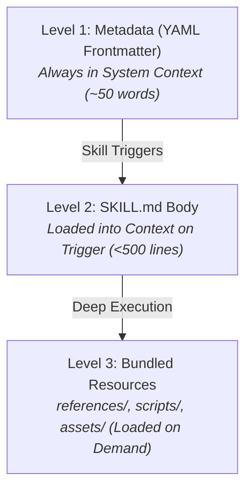

# Agent Skill Authoring Guide

An engineering handbook for designing, formatting, and distributing agent skills compatible with Google Antigravity, Gemini CLI, Claude Code, Cursor, and the open `skills.sh` registry.

---

## 🏛️ 1. The 3-Level Progressive Disclosure Architecture

Skills must adhere to a strict 3-level progressive disclosure hierarchy to maximize LLM context window efficiency:



1. **Level 1: YAML Frontmatter (`name` + `description`)**:
   * Stored in the agent's active system prompt at all times.
   * **Rule**: Keep it to 1–2 punchy sentences stating **WHAT** the skill does and **WHEN** it triggers.
   * **Anti-Pattern**: Avoid long multi-paragraph descriptions or speculative fluff.
2. **Level 2: `SKILL.md` Execution Body**:
   * Read into context only when the skill is explicitly or semantically invoked.
   * **Rule**: Keep under 500 lines. Focus on imperative execution steps, concrete fixtures, and hard constraints.
3. **Level 3: Bundled Resources (`references/`, `scripts/`, `assets/`)**:
   * Heavy reference documentation, AST scripts, or asset templates.
   * **Rule**: Referenced clearly from `SKILL.md` with explicit instructions on when to view or execute them.

---

## 📝 2. Why Markdown is Mandatory for Skill Instructions

LLMs (including Gemini 3.x, Claude 3.x, and GPT-4o) rely on structural Markdown semantics during attention routing:

* **Heading Hierarchies (`#`, `##`, `###`)**: Define unambiguous semantic boundaries between steps, goals, and constraints.
* **Code Fences with Language Identifiers (` ```bash `, ` ```json `)**: Prevent the model from misinterpreting code examples as conversational instructions.
* **Tables**: Present comparative matrices and decision gates with zero ambiguity.
* **Token Efficiency**: Markdown carries almost zero syntax overhead compared to XML or JSON while providing clean human and machine readability.

---

## 📐 3. Optimal `SKILL.md` Structural Template

Structure every `SKILL.md` in the exact sequence frontier models attend to best:

```markdown
---
name: your-skill-name
description: Short, punchy summary of what it does and when it triggers.
---

# Skill Name

Brief 1-sentence overview of the skill.

---

## 🎯 Goal
What success looks like in concrete terms.

---

## 📋 Step-by-Step Workflow
1. **Step 1 (Imperative Action)**: Specific command or inspection.
2. **Step 2 (Transformation)**: Specific processing or authoring.
3. **Step 3 (Verification)**: Automated check or assertion.

---

## 💡 Concrete Examples
### Before / After Diff or Sample Fixture
Show exact code, JSON, or markdown transformations.

---

## 🚫 Hard Constraints
* **NEVER** do X.
* **NEVER** violate Y.
```

---

## 👤 4. Attribution & Clean Context Separation

To prevent biographical credits or licenses from cluttering the agent's procedural thinking during task execution:
* Keep `SKILL.md` 100% focused on procedural instructions.
* Document original authors, repositories, and licenses inside `README.md` and `catalog.json`.

---

## 🚀 5. Distribution & Installation Compatibility

Skills must support two distribution paths:
1. **Open Registry (`skills.sh` / `npx skills`)**:
   ```bash
   npx skills add ksprashu/agent-skill-forge --skill <name>
   ```
2. **Instant Local Symlinking (`sync_skills.py`)**:
   ```bash
   python3 scripts/sync_skills.py --project . --skills <name1>,<name2>
   ```

---

## 📚 References & Further Reading
* [Anthropic Skills Standard & Creator](https://github.com/anthropics/skills)
* [Addy Osmani Agent Skills](https://github.com/addyosmani/agent-skills)
* [Matt Pocock Skills Catalog](https://github.com/mattpocock/skills)
* [Open Knowledge Format (OKF) Specification](file:///Users/ksprashanth/code/github/agent-skill-forge/.gemini/knowledge/index.md)
