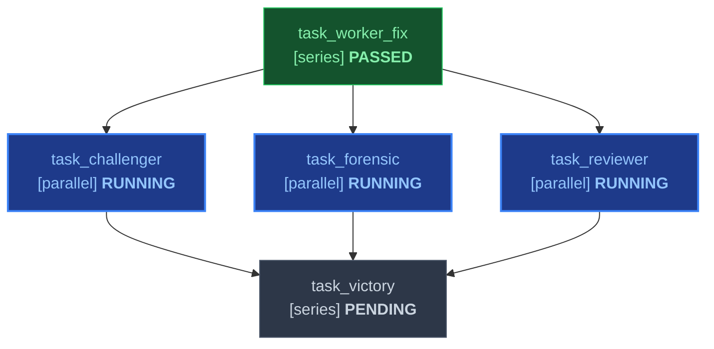

# Plan: Task Slicing & Declarative Markdown DAG Engine

Decompose user requirements, architecture proposals, and specifications into standardized, verifiable **Declarative Markdown Directed Acyclic Graphs (DAGs)** that human engineers and autonomous multi-agent swarms (`/work`) can parse, validate, and execute directly.

---

## 🎯 Goal

Transform ambiguous or complex initiatives into an executable, acyclic dependency graph with explicit task execution modes (`series`, `parallel`, `async_background`), rigorous physical artifact contracts (`inputs` and `outputs`), deterministic barrier gates, and live Mermaid status visualization.

---

## 🏗️ The Declarative Markdown DAG Specification Standard

Every plan output produced by `/plan` (saved to `DAG.md`, `tasks/plan.md`, or `.agents/orchestrator/PROJECT.md`) adheres to the standard schema defined in [dag_specification.md](references/dag_specification.md):

### 1. Canonical Task Graph Table (8 Columns)
```markdown
| ID | Task Name | Mode | Depends On | Inputs | Outputs | Gate | Status |
|---|---|---|---|---|---|---|---|
| task_worker_fix | Bugfix Implementation Worker | series | none | ORIGINAL_REQUEST.md | src/patch.py, tests/test_patch.py, .agents/worker_fix/handoff.md | pytest tests/test_patch.py | PASSED |
| task_reviewer | 5-Axis Adversarial Reviewer | parallel | task_worker_fix | src/patch.py, .agents/worker_fix/handoff.md | .agents/reviewer_fix/review.md | review_5axis_pass | RUNNING |
| task_challenger | Adversarial Boundary Challenger | parallel | task_worker_fix | src/patch.py, tests/test_patch.py | tests/test_hostile.py, .agents/challenger_fix/handoff.md | pytest tests/test_hostile.py | RUNNING |
| task_forensic | Forensic Integrity Auditor | parallel | task_worker_fix | src/patch.py, tests/test_patch.py | .agents/auditor_fix/handoff.md | python3.12 skills/work/scripts/forensic_audit.py --integrity-mode development | RUNNING |
| task_victory | Terminal Victory Certification | series | task_reviewer, task_challenger, task_forensic | .agents/reviewer_fix/review.md, .agents/challenger_fix/handoff.md, .agents/auditor_fix/handoff.md | .agents/victory_auditor/handoff.md | pytest -v && python3.12 skills/work/scripts/forensic_audit.py --strict | PENDING |
```

### 2. Task Execution Modes
- **`series`**: Blocking sequential execution. Scheduled only when all `Depends On` tasks have status `PASSED`. Blocks downstream tasks until `PASSED`. Used for core implementations, schema migrations, and victory gates.
- **`parallel`**: Concurrent sibling execution. Dispatched simultaneously in batch via `invoke_subagent` once all dependencies are `PASSED`. Runs in isolated workspaces. Used for exploratory surveys, competitive tournaments, and Adversarial Committees (Reviewer, Challenger, Forensic Auditor).
- **`async_background`**: Non-blocking continuous monitoring or watchdog process. Dispatched via Antigravity `schedule` crons or background tasks (`IsDaemon: true`). Runs continuously throughout the phase without blocking milestone progression. Used for Sentinel heartbeat crons and telemetry loggers.

### 3. Artifact Data Flow Contracts (Anti-Polling Invariant)
- **`Inputs`**: Repository-relative paths that **MUST physically exist on disk and be non-empty before dispatch**. The Orchestrator strictly refrains from dispatching subagents until all prerequisite inputs exist, eliminating wasteful busy-wait polling loops.
- **`Outputs`**: Repository-relative deliverables (source code, test files, handoff reports) that **MUST physically exist on disk before transitioning to `PASSED`**. Handoff reports must adhere to the 5-component standard (Observation, Logic Chain, Caveats, Conclusion, Verification Method).

### 4. Barrier Gates & State Checks
- Objective preconditions evaluated before marking any task `PASSED`.
- Requires physical exit code 0 from the declared test/verification command, verified existence of all declared `Outputs`, and zero mock bypasses (`forensic_audit.py`).

### 5. Live Mermaid Flowchart TD Visualizer
- Embedded `mermaid` flowchart block rendering nodes with real-time CSS status classes (`status-passed`, `status-running`, `status-pending`, `status-blocked`, `status-failed`).
- Maintained in sync with the task table via `python3.12 skills/work/scripts/dag_validator.py <file> --set-status <id>=<status> --update-file`.

---

## 📋 Step-by-Step Planning Workflow

1. **Read-Only Inspection**:
   - Inspect `SPEC.md`, `ORIGINAL_REQUEST.md`, or codebase context.
   - **STRICT PROHIBITION**: Do NOT write, modify, or delete any functional implementation files during planning.
2. **Environment & Tool Scoping**:
   - If external services (databases, cloud platforms, CLIs) are required, design setup tasks to scaffold project plugins under `.agents/plugins/` or local `.env` configurations. Never assume ambient global MCP servers.
3. **Select Execution Topology**:
   - **Focused Bugfix Swarm (`Topology: focused`)**: For targeted fixes, regressions, or single-issue refactors. Outputs to `DAG.md` or `tasks/plan.md`.
   - **Multi-Milestone Swarm (`Topology: full`)**: For complex features, migrations, or large initiatives. Outputs to `DAG.md` or `.agents/orchestrator/PROJECT.md`.
   - **Single-Agent Slice (`Topology: single-agent`)**: For standalone developer tasks avoiding swarm overhead. Outputs to `tasks/plan.md`.
   - Other topologies: `review`, `proof`, `massive` (see `skills/work/references/team_topologies.md`).
4. **Author Declarative Markdown DAG**:
   - Construct the 8-column task matrix (`ID`, `Task Name`, `Mode`, `Depends On`, `Inputs`, `Outputs`, `Gate`, `Status`).
   - Explicitly classify each node as `series`, `parallel`, or `async_background`.
   - Map explicit predecessor IDs in `Depends On` (use `none` for root tasks).
   - Specify concrete file paths in `Inputs` and `Outputs`.
   - Embed the live Mermaid flowchart TD block modeling dependencies and initial status states.
5. **Define Barrier Gates & Verification Checkpoints**:
   - Assign automated, non-interactive verification commands (e.g. `pytest <path>`, `python3.12 scripts/validate_skills.py`, `exit_0`) to prove task completion.
6. **Validate DAG Integrity via Harness**:
   - Execute the DAG validator to assert graph acyclicity, dependency existence, and contract syntax:
     ```bash
     python3.12 skills/work/scripts/dag_validator.py DAG.md
     ```
   - Ensure the validator reports `✅ VALID` with 0 errors before presenting the plan or triggering `/work`.

---

## 💡 Standardized DAG Fixtures

Ready-to-use fixtures and templates are documented in [dag_templates.md](references/dag_templates.md):

### 1. Focused Bugfix Swarm Fixture
```markdown
# Declarative DAG: Focused Bugfix Swarm

Topology: focused | Integrity Mode: development

| ID | Task Name | Mode | Depends On | Inputs | Outputs | Gate | Status |
|---|---|---|---|---|---|---|---|
| task_worker_fix | Bugfix Implementation Worker | series | none | ORIGINAL_REQUEST.md | src/patch.py, tests/test_patch.py, .agents/worker_fix/handoff.md | pytest tests/test_patch.py | PASSED |
| task_reviewer | 5-Axis Adversarial Reviewer | parallel | task_worker_fix | src/patch.py, .agents/worker_fix/handoff.md | .agents/reviewer_fix/review.md | review_5axis_pass | RUNNING |
| task_challenger | Adversarial Boundary Challenger | parallel | task_worker_fix | src/patch.py, tests/test_patch.py | tests/test_hostile.py, .agents/challenger_fix/handoff.md | pytest tests/test_hostile.py | RUNNING |
| task_forensic | Forensic Integrity Auditor | parallel | task_worker_fix | src/patch.py, tests/test_patch.py | .agents/auditor_fix/handoff.md | python3.12 skills/work/scripts/forensic_audit.py --integrity-mode development | RUNNING |
| task_victory | Terminal Victory Certification | series | task_reviewer, task_challenger, task_forensic | .agents/reviewer_fix/review.md, .agents/challenger_fix/handoff.md, .agents/auditor_fix/handoff.md | .agents/victory_auditor/handoff.md | pytest -v && python3.12 skills/work/scripts/forensic_audit.py --strict | PENDING |


```

### 2. Multi-Milestone Project Swarm Fixture
See [dag_templates.md § 2](references/dag_templates.md#2-template-2-multi-milestone-project-swarm) for the full 8-node multi-milestone platform swarm with parallel explorers, implementation workers, adversarial committees, and victory certification.

### 3. Single-Agent Vertical Slice Fixture
See [dag_templates.md § 3](references/dag_templates.md#3-template-3-single-agent-vertical-slice) for standalone sequential vertical slices with automated test checkpoints.

---

## 🔗 Bridge & Direct Execution via `/work`

The Markdown DAG generated by `/plan` serves as the direct execution contract for `/work`:
1. **Direct Ingestion**: When `/work` triggers, it checks for `DAG.md` or `.agents/orchestrator/PROJECT.md`. If present, `/work` immediately skips redundant planning and executes the DAG directly.
2. **Ready Frontier Resolution**: The Orchestrator identifies all tasks where `status == PENDING`, all `Depends On` tasks are `PASSED`, and all `Inputs` physically exist on disk. These tasks are dispatched concurrently in a single batch via `invoke_subagent`.
3. **Anti-Polling Dormancy**: If upstream inputs do not exist on disk, downstream subagents are NEVER dispatched. The Orchestrator sleeps until woken reactively by Antigravity message events.
4. **Dynamic DAG Mutation**: If an adversarial committee check fails, the Orchestrator mutates the DAG table dynamically by inserting a remediation node (`task_remediation`), rewiring downstream dependencies, and refreshing the Mermaid diagram.

---

## 📚 Detailed Reference Documentation

- [dag_specification.md](references/dag_specification.md): Formal grammar, column definitions, execution modes, normalization rules, and validation algorithms.
- [dag_templates.md](references/dag_templates.md): Production templates for Focused Bugfix, Multi-Milestone Swarm, and Single-Agent Vertical Slices.

---

## 🚫 Hard Invariants & Guardrails

* **NEVER** write, modify, or delete functional source code during the planning phase.
* **NEVER** output unstructured prose task checklists without the canonical Markdown DAG table and Mermaid diagram.
* **NEVER** create tasks without explicit physical `Inputs` and `Outputs` (prohibiting ungrounded ghost tasks).
* **NEVER** dispatch or schedule subagents before their declared prerequisite input files physically exist on disk (zero polling loops).
* **NEVER** mark a task `PASSED` without objective exit code 0 verification from its barrier gate.
* **ALL** generated DAG specifications MUST pass `python3.12 skills/work/scripts/dag_validator.py` with 100% validity.
