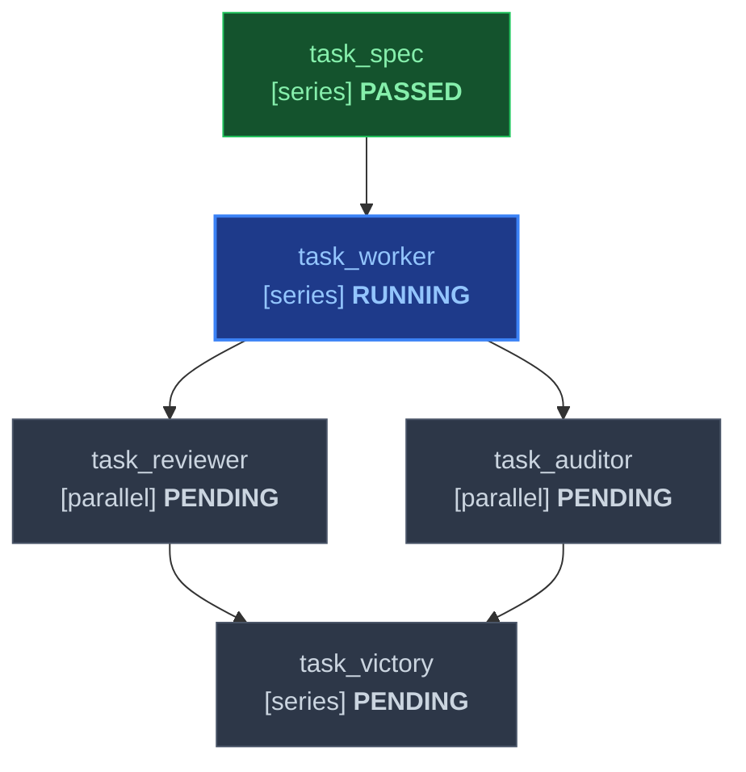

# Declarative Markdown DAG Task Specification Standard

This document establishes the formal specification for the **Declarative Markdown Directed Acyclic Graph (DAG) Task Specification Schema** used across `skills/plan` and `skills/work` in `agent-skill-forge`.

The specification defines a standardized, human-readable, and machine-parseable representation of multi-agent engineering workflows. It provides unambiguous contracts for execution modes (`series`, `parallel`, `async_background`), topological dependencies, physical artifact inputs and outputs, deterministic barrier gates, and live Mermaid status visualization.

---

## 1. Authoritative Task Graph Schema

A valid Markdown DAG task table consists of an 8-column GitHub Flavored Markdown (GFM) table.

### 1.1 Canonical Table Definition

```markdown
| ID | Task Name | Mode | Depends On | Inputs | Outputs | Gate | Status |
|---|---|---|---|---|---|---|---|
| task_spec | Specification & Contract Review | series | none | ORIGINAL_REQUEST.md | docs/spec.md | exit_0 | PASSED |
| task_worker | Core Architecture Implementation | series | task_spec | docs/spec.md | src/core.py, tests/test_core.py | pytest tests/test_core.py | RUNNING |
| task_reviewer | 5-Axis Adversarial Review | parallel | task_worker | src/core.py | .agents/reviewer/report.md | review_pass | PENDING |
| task_auditor | Forensic Integrity Audit | parallel | task_worker | src/core.py, tests/test_core.py | .agents/auditor/report.md | zero_mock | PENDING |
| task_victory | Terminal Victory Certification | series | task_reviewer, task_auditor | .agents/reviewer/report.md, .agents/auditor/report.md | .agents/sentinel/VICTORY.md | all_passed | PENDING |
```

### 1.2 Column Definitions & Semantics

| Column | Header Aliases | Type | Description & Semantic Constraints |
|---|---|---|---|
| **ID** | `Task ID`, `ID`, `#` | `string` | Unique task identifier token. Must consist of alphanumeric characters, underscores, and hyphens (`[a-zA-Z0-9_\-]+`). Must be unique across the entire DAG document. Disallows empty strings and separator tokens. |
| **Task Name** | `Title`, `Name`, `Task Title` | `string` | Human-readable title summarizing the objective of the task. May contain alphanumeric characters, spaces, and punctuation. |
| **Mode** | `Execution Mode`, `Type`, `Mode` | `enum` | Execution mode governing concurrency and scheduling: `series`, `parallel`, or `async_background` (case-insensitive). |
| **Depends On** | `Dependencies`, `Deps`, `Prerequisites` | `list[string]` | Comma-separated or semicolon-separated list of predecessor task IDs that must achieve `PASSED` status before this task can be scheduled. Root nodes with zero dependencies declare `none`, `-`, or `[]`. |
| **Inputs** | `Required Inputs`, `Inputs` | `list[string]` | Comma-separated list of repository-relative file paths required as input prerequisites. **Must physically exist on disk before the task is dispatched.** Non-file tasks specify `none` or `-`. |
| **Outputs** | `Produced Outputs`, `Outputs`, `Artifacts` | `list[string]` | Comma-separated list of repository-relative file paths produced as guaranteed deliverables (e.g. source code, test files, handoffs). **Must physically exist on disk before marking the task `PASSED`.** |
| **Gate** | `Barrier Gate`, `Barrier`, `Gate`, `Preconditions` | `string` | Deterministic verification condition, shell command, or gate predicate that must evaluate to exit code 0 before transitioning the task to `PASSED`. |
| **Status** | `State`, `Status` | `enum` | Current lifecycle state: `PENDING`, `RUNNING`, `PASSED`, `BLOCKED`, or `FAILED` (case-insensitive). |

### 1.3 Normalization Rules

1. **Empty Tokens**: Cells containing `none`, `null`, `nil`, `-`, `[]`, `n/a`, or whitespace normalize to empty lists (`[]`) or default sentinel values (`"none"`).
2. **Path Delimiters**: Forward slashes (`/`) and Windows backslashes (`\`) in file paths are normalized cleanly across platforms.
3. **Escaped Characters**: Markdown table pipes within commands or labels must be escaped as `\|` (e.g. `grep -v "TODO" \| wc -l`). The parser treats escaped pipes as cell content rather than column dividers.
4. **Token Trimming**: Leading and trailing backticks, quotation marks, and whitespace around identifiers, file paths, and statuses are trimmed automatically.

---

## 2. Task Execution Modes & Scheduling Semantics

Every node in the DAG must be explicitly assigned one of three execution modes:

```
┌─────────────────────────────────────────────────────────────────────────────┐
│                          TASK EXECUTION MODES                               │
├─────────────────┬───────────────────────────────────────────────────────────┤
│ Mode            │ Dispatch Semantics & Lifecycle Behavior                   │
├─────────────────┼───────────────────────────────────────────────────────────┤
│ series          │ Blocking Sequential Task:                                 │
│                 │ • Enters ready frontier only when ALL declared `depends_on`│
│                 │   tasks have achieved status `PASSED`.                    │
│                 │ • Downstream dependent tasks remain dormant until this    │
│                 │   task reaches `PASSED`.                                  │
│                 │ • Used for: core worker implementations, migrations,      │
│                 │   synthesis arbiters, and terminal victory gates.         │
├─────────────────┼───────────────────────────────────────────────────────────┤
│ parallel        │ Concurrent Sibling Task:                                  │
│                 │ • Dispatched concurrently in a single batch with all      │
│                 │   sibling tasks whose dependencies are satisfied.         │
│                 │ • Executes in isolated workspaces (`Workspace: "branch"`  │
│                 │   or read-only `"share"`). Sibling tasks run without      │
│                 │   blocking one another.                                   │
│                 │ • Used for: parallel exploratory surveys, competitive     │
│                 │   worker tournaments, and Adversarial Committees.         │
├─────────────────┼───────────────────────────────────────────────────────────┤
│ async_background│ Non-Blocking Continuous Watchdog / Daemon:                │
│                 │ • Dispatched alongside active milestone tasks via         │
│                 │   Antigravity `schedule` crons or background daemons      │
│                 │   (`IsDaemon: true`).                                     │
│                 │ • Runs continuously throughout the phase without blocking │
│                 │   downstream series milestone gates.                      │
│                 │ • Used for: Sentinel heartbeat crons, test watchers,      │
│                 │   and continuous telemetry monitors.                      │
└─────────────────┴───────────────────────────────────────────────────────────┘
```

---

## 3. Dependency Graph & Topological Integrity

1. **Acyclicity (DAG Invariant)**: The graph formed by directed dependency edges (`dependency --> dependent`) must be strictly acyclic. Directed cycles of any length ($1, 2, 3, \dots, N$) are invalid. The harness detects cycles via 3-color Depth-First Search (DFS) traversal and reports the exact cyclic path.
2. **Topological Ordering**: Task execution order is computed via Kahn's algorithm. Tasks with in-degree 0 are evaluated first; tasks with in-degree $> 0$ are scheduled only after all upstream dependencies are satisfied.
3. **No Ghost Dependencies**: Every identifier referenced in `Depends On` must correspond to a declared task row in the table. Referencing undefined task IDs triggers validation error `MISSING_DEPENDENCY`.
4. **ID Uniqueness**: Each task `ID` must appear exactly once. Duplicate task IDs trigger validation error `DUPLICATE_TASK_ID`.

---

## 4. Artifact & Data Flow Contracts (Anti-Polling Invariant)

The DAG specification enforces strict physical data contracts to eliminate hallucinations and wasteful busy-wait polling loops.

### 4.1 Physical Precondition Contracts (`Inputs`)
- Every relative file path declared in `Inputs` **MUST physically exist on disk and be non-empty** before the Orchestrator is allowed to dispatch the task subagent via `invoke_subagent`.
- If an input file is missing or unwritten, the task **MUST NOT** be dispatched. The Orchestrator enters dormancy and awaits upstream completion via Antigravity's reactive message resumption.
- Subagents are instructed to assert input artifact existence as a pre-flight check upon wakeup. If inputs are missing, the subagent terminates immediately rather than looping.

### 4.2 Physical Delivery Contracts (`Outputs`)
- Every file path declared in `Outputs` **MUST physically exist on disk and be non-empty** before the task can transition from `RUNNING` to `PASSED`.
- Handoff reports (`.agents/<role>/handoff.md`) must satisfy the 5-component standard:
  1. **Observation**: Exact file paths, line numbers, verbatim test commands and outputs.
  2. **Logic Chain**: Step-by-step reasoning from observations to conclusions.
  3. **Caveats**: Scope boundaries, uninvestigated areas, assumptions made.
  4. **Conclusion**: Final assessment, directly actionable and scoped.
  5. **Verification Method**: Concrete test commands to independently reproduce results.

### 4.3 Path Validation Constraints
- **Workspace-Relative Only**: All artifact paths must be relative to the repository workspace root (e.g. `src/auth.py`, `.agents/worker/handoff.md`).
- **Disallowed Absolute Roots**: Paths starting with `/`, `\`, `~`, or drive letters (`C:\`) violate project isolation and are rejected with `ABSOLUTE_PATH_DISALLOWED`.
- **Disallowed Characters**: Paths containing wildcard or shell injection characters (`<`, `>`, `"`, `|`, `?`, `*`) are rejected with `ILLEGAL_PATH_CHARS`.

---

## 5. Barrier Gates & State Transitions

Barrier gates are objective, automated criteria evaluated before marking a node `PASSED`.

### 5.1 Gate Preconditions
A task achieves `PASSED` status if and only if:
1. All declared `Outputs` exist on disk and are non-empty.
2. The gate command or predicate executes with physical **exit code 0**.
3. Anti-mock AST audit passes (`python3.12 skills/work/scripts/forensic_audit.py`).
4. Upstream dependencies are verified consistent (a task cannot be `PASSED` if its dependency is `FAILED` or `BLOCKED`).

### 5.2 Common Gate Types
- **Test Suite Execution**: `pytest tests/test_core.py`, `python3.12 -m unittest discover`
- **Lint & Static Check**: `python3.12 scripts/validate_skills.py`, `npm run lint`
- **Simple Exit Code**: `exit_0` (asserts previous command succeeded)
- **Adversarial Committee Approval**: `review_5axis_pass`, `zero_mock`, `committee_join`
- **Victory Gate**: `victory_gate` (clean-slate independent reproduction)

---

## 6. Live Mermaid DAG Visualizer Specification

Every Markdown DAG specification embeds a live Mermaid diagram immediately following or preceding the task table. The diagram visually reflects task modes, topological dependencies, and real-time execution states.

### 6.1 Mermaid Diagram Syntax



### 6.2 Status Styling Color Palette

| Status | CSS Class | Fill Color | Stroke Color | Text Color | Visual Meaning |
|---|---|---|---|---|---|
| `PENDING` | `status-pending` | `#2d3748` (Slate Dark) | `#4a5568` (Gray) | `#cbd5e0` | Dormant, awaiting upstream dependencies |
| `RUNNING` | `status-running` | `#1e3a8a` (Deep Blue) | `#3b82f6` (Vibrant Blue) | `#93c5fd` | Actively executing; inputs verified |
| `PASSED` | `status-passed` | `#14532d` (Forest Green)| `#22c55e` (Emerald Green) | `#86efac` | Outputs verified on disk; gate exit 0 |
| `BLOCKED` | `status-blocked` | `#78350f` (Amber Dark) | `#f59e0b` (Amber Orange) | `#fde68a` | Upstream failure or missing prerequisite |
| `FAILED` | `status-failed` | `#7f1d1d` (Crimson Dark)| `#ef4444` (Bright Red) | `#fca5a5` | Crashed or rejected by barrier gate |

---

## 7. Ready Frontier Resolution Algorithm

The Orchestrator evaluates the **Ready Frontier** to determine which tasks can be dispatched in parallel at any given instant.

```
┌────────────────────────────────────────────────────────────────────────┐
│                   READY FRONTIER RESOLUTION PIPELINE                   │
└──────────────────────────────────┬─────────────────────────────────────┘
                                   │
                                   ▼
          ┌─────────────────────────────────────────────────┐
          │ Step 1: Candidate Filtering                     │
          │ Select all tasks where `status == PENDING`.     │
          └────────────────────────┬────────────────────────┘
                                   │
                                   ▼
          ┌─────────────────────────────────────────────────┐
          │ Step 2: Dependency Precondition Check           │
          │ For each candidate, verify that ALL predecessor  │
          │ task IDs in `depends_on` have status `PASSED`.   │
          │ (Nodes with `depends_on: none` pass immediately)│
          └────────────────────────┬────────────────────────┘
                                   │
                                   ▼
          ┌─────────────────────────────────────────────────┐
          │ Step 3: Physical Artifact Existence Check        │
          │ Verify that every declared relative path in     │
          │ `Inputs` physically exists on disk and is not   │
          │ empty. If any input is missing, remain DORMANT. │
          └────────────────────────┬────────────────────────┘
                                   │
                                   ▼
          ┌─────────────────────────────────────────────────┐
          │ Step 4: Batch Concurrent Dispatch                │
          │ Dispatch all resolved tasks in a single wave    │
          │ via `invoke_subagent`. Update statuses to       │
          │ `RUNNING` and sync Mermaid diagram.             │
          └─────────────────────────────────────────────────┘
```

---

## 8. In-Place Synchronization & Dynamic DAG Evolution

### 8.1 Automated CLI Synchronization
The DAG engine CLI (`skills/work/scripts/dag_validator.py`) allows atomic in-place updates:
```bash
# Update task status and synchronize table + Mermaid block in one step
python3.12 skills/work/scripts/dag_validator.py DAG.md --set-status task_worker=PASSED --update-file

# Inspect current ready frontier
python3.12 skills/work/scripts/dag_validator.py DAG.md --ready-frontier

# Validate physical artifacts on disk
python3.12 skills/work/scripts/dag_validator.py DAG.md --check-artifacts
```

### 8.2 Dynamic DAG Mutation (Remediation Protocol)
When an adversarial check fails (e.g. Challenger writes a failing edge-case test, or Forensic Auditor detects mock code):
1. The active Worker node transitions to `FAILED`.
2. Downstream dependent nodes transition to `BLOCKED`.
3. The Orchestrator dynamically mutates the DAG table:
   - Inserts remediation task `task_remediation` with `depends_on: [task_worker]`, `inputs: [failing_test.py, src/core.py]`, and `outputs: [src/core.py, .agents/remediation/handoff.md]`.
   - Rewires downstream Reviewer and Auditor to depend on `task_remediation`.
   - Capped at `MAX_MUTATIONS = 4` to prevent infinite oscillation.
4. The Mermaid diagram is regenerated to reflect the remediation branch.
