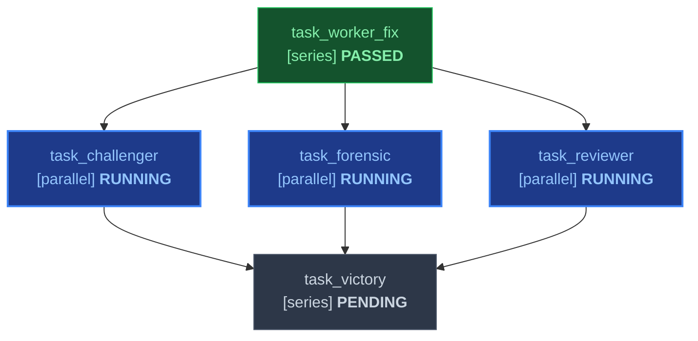
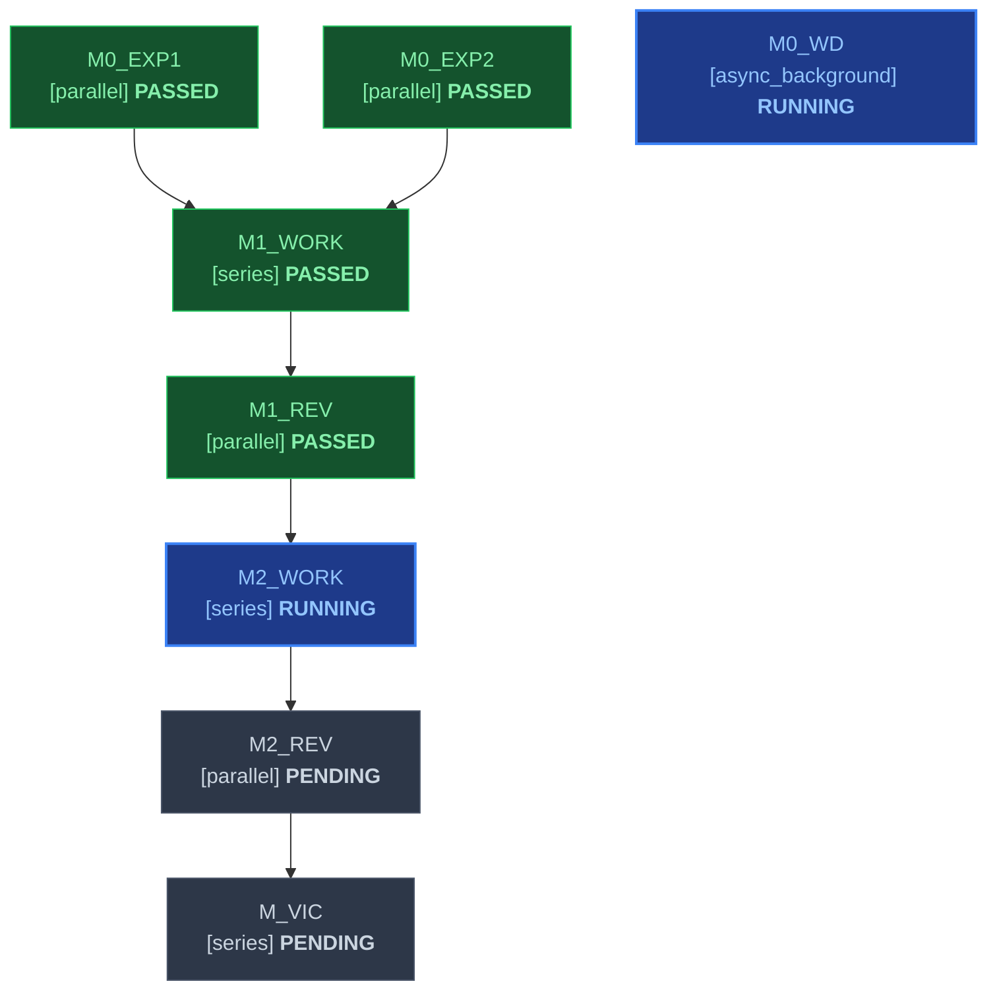
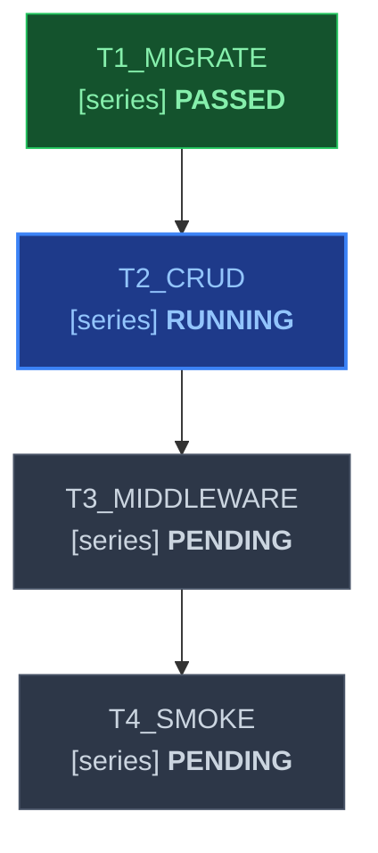

# Standardized Markdown DAG Workflow Templates

This document provides production-ready, validated templates for the **Declarative Markdown DAG Task Specification Schema**. These templates represent the standard execution topologies used in `agent-skill-forge` across `skills/plan` and `skills/work`.

---

## 1. Template 1: Focused Bugfix / Single-Change Swarm

**Topology**: `focused`  
**Integrity Mode**: `development` (or `demo`, `benchmark`)  
**Use Cases**: Self-contained bugfixes, targeted regressions, localized refactorings, and single-issue remediations.  
**Target File**: `DAG.md` or `tasks/plan.md`

### Task Graph Table
| ID | Task Name | Mode | Depends On | Inputs | Outputs | Gate | Status |
|---|---|---|---|---|---|---|---|
| task_worker_fix | Bugfix Implementation Worker | series | none | ORIGINAL_REQUEST.md | src/patch.py, tests/test_patch.py, .agents/worker_fix/handoff.md | pytest tests/test_patch.py | PASSED |
| task_reviewer | 5-Axis Adversarial Reviewer | parallel | task_worker_fix | src/patch.py, .agents/worker_fix/handoff.md | .agents/reviewer_fix/review.md | review_5axis_pass | RUNNING |
| task_challenger | Adversarial Boundary Challenger | parallel | task_worker_fix | src/patch.py, tests/test_patch.py | tests/test_hostile.py, .agents/challenger_fix/handoff.md | pytest tests/test_hostile.py | RUNNING |
| task_forensic | Forensic Integrity Auditor | parallel | task_worker_fix | src/patch.py, tests/test_patch.py | .agents/auditor_fix/handoff.md | python3.12 skills/work/scripts/forensic_audit.py --integrity-mode development | RUNNING |
| task_victory | Terminal Victory Certification | series | task_reviewer, task_challenger, task_forensic | .agents/reviewer_fix/review.md, .agents/challenger_fix/handoff.md, .agents/auditor_fix/handoff.md | .agents/victory_auditor/handoff.md | pytest -v && python3.12 skills/work/scripts/forensic_audit.py --strict | PENDING |

### Live Mermaid Diagram


---

## 2. Template 2: Multi-Milestone Project Swarm

**Topology**: `full`  
**Integrity Mode**: `development`  
**Use Cases**: Multi-stage feature development, architectural migrations, platform rearchitectures, multi-agent swarms.  
**Target File**: `DAG.md` or `.agents/orchestrator/PROJECT.md`

### Task Graph Table
```markdown
| ID | Task Name | Mode | Depends On | Inputs | Outputs | Gate | Status |
|---|---|---|---|---|---|---|---|
| M0_EXP1 | Codebase Architecture Survey | parallel | none | ORIGINAL_REQUEST.md | .agents/survey_1/handoff.md | exit_0 | PASSED |
| M0_EXP2 | API Contracts & Grounding Survey | parallel | none | ORIGINAL_REQUEST.md | .agents/survey_2/handoff.md | exit_0 | PASSED |
| M0_WD | Sentinel Liveness Watchdog | async_background | none | none | .agents/sentinel/heartbeat.log | cron: */10 * * * * | RUNNING |
| M1_WORK | Core Data Layer Implementation | series | M0_EXP1, M0_EXP2 | .agents/survey_1/handoff.md, .agents/survey_2/handoff.md | migrations/001_init.sql, src/db/schema.py, tests/test_db.py | pytest tests/test_db.py | PASSED |
| M1_REV | M1 Adversarial Committee Gate | parallel | M1_WORK | src/db/schema.py, tests/test_db.py | .agents/m1_committee/handoff.md | committee_join | PASSED |
| M2_WORK | Core Business Logic Implementation | series | M1_REV | src/db/schema.py, .agents/m1_committee/handoff.md | src/auth/session.py, tests/test_auth.py | pytest tests/test_auth.py | RUNNING |
| M2_REV | M2 Adversarial Committee Gate | parallel | M2_WORK | src/auth/session.py, tests/test_auth.py | .agents/m2_committee/handoff.md | committee_join | PENDING |
| M_VIC | Terminal Victory Certification | series | M2_REV | .agents/m2_committee/handoff.md | .agents/victory_auditor/handoff.md | python3.12 skills/work/scripts/forensic_audit.py --strict | PENDING |
```

### Live Mermaid Diagram


---

## 3. Template 3: Single-Agent Vertical Slice

**Topology**: `single-agent`  
**Use Cases**: Focused, single-agent development tasks avoiding multi-agent swarm overhead while maintaining rigorous DAG checkpoints.  
**Target File**: `tasks/plan.md`

### Task Graph Table
```markdown
| ID | Task Name | Mode | Depends On | Inputs | Outputs | Gate | Status |
|---|---|---|---|---|---|---|---|
| T1_MIGRATE | SQLite Sessions Migration | series | none | SPEC.md | migrations/001_sessions.sql, tests/test_migrations.py | pytest tests/test_migrations.py | PASSED |
| T2_CRUD | Session Repository CRUD | series | T1_MIGRATE | migrations/001_sessions.sql | src/auth/repo.py, tests/test_auth_repo.py | pytest tests/test_auth_repo.py | RUNNING |
| T3_MIDDLEWARE | HTTP Auth Middleware | series | T2_CRUD | src/auth/repo.py | src/middleware/auth.py, tests/test_auth_middleware.py | pytest tests/test_auth_middleware.py | PENDING |
| T4_SMOKE | End-to-End Smoke Verification | series | T3_MIDDLEWARE | src/middleware/auth.py | tests/e2e/test_auth_flow.py | pytest tests/e2e/test_auth_flow.py | PENDING |
```

### Live Mermaid Diagram


---

## 4. Execution Protocol: How `/work` Runs These Templates

When `/work` is invoked:
1. **Locates Specification**: Checks for an existing `DAG.md` or `.agents/orchestrator/PROJECT.md`. If found, `/work` uses it directly without re-planning.
2. **Computes Ready Frontier**: Dispatches all tasks whose `Depends On` tasks are `PASSED` and whose `Inputs` physically exist on disk.
3. **Monitors Completion**: As subagents deliver outputs and handoff reports, evaluates the `Gate` command.
4. **Updates File In-Place**: Executes `python3.12 skills/work/scripts/dag_validator.py <file> --set-status <id>=PASSED --update-file` to keep the table and Mermaid diagram synchronized.
