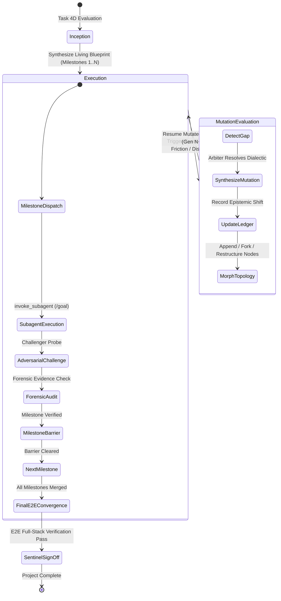

# 🧬 Dynamic Living Blueprint Engine: Emergent Topology, Milestones & E2E Convergence

The **Dynamic Living Blueprint Engine** is the core orchestration framework for Google Antigravity and Gemini multi-agent systems. It moves beyond static, one-size-fits-all DAG templates by dynamically synthesizing bespoke collaboration blueprints, organizing workflows into staged **Milestones**, and evolving them in-flight as agents uncover new constraints, concluding with a mandatory **E2E Integration & Convergence Milestone**.

---

## 1. Why Static Templates Fail & The Teamwork Decoupling Principle

Traditional multi-agent systems rely on rigid, pre-baked workflow templates (e.g., standard "dev -> test -> review" pipelines). These fail in real-world software engineering because:
1. **Uncertainty is Asymmetric**: A task that appears simple (e.g., "upgrade library X") may uncover deep breaking changes or subtle concurrency races midway through execution.
2. **Author Self-Delusion**: Single-agent or cooperative-only teams suffer from confirmation bias, mocking complex assertions or skipping unhandled error branches.
3. **Missing Systemic Synthesis**: Individual components may pass isolated tests, but fail when assembled together into full end-to-end user journeys.

### The Teamwork Decoupling Principle
Inspired by Google Antigravity's **Teamwork** framework (`/teamwork-preview`), the Blueprint Engine **strictly decouples orchestration topology from worker implementation**:
- **The Blueprint** is a machine-readable, mutable specification defining milestones, participants, communication graphs, dialectical tensions, adversarial gates, and terminal E2E convergence criteria.
- **The Agents** are ephemeral actors dispatched into isolated workspaces (`Workspace: "branch"` for producers, `Workspace: "share"` for auditors) guided strictly by the Living Blueprint.

```
┌────────────────────────────────────────────────────────────────────────────────────────┐
│                                DYNAMIC LIVING BLUEPRINT                                │
│                                                                                        │
│   ┌──────────────────┐      ┌─────────────────────────┐      ┌─────────────────────┐   │
│   │ Staged Milestone │ ───► │    Epistemic Ledger     │ ───► │ Adversarial Matrix │   │
│   │ Hierarchy & DAG  │      │ (Knowns, Unknowns,      │      │ (Challenger Probes, │   │
│   │ (Barrier Gates)  │      │  Discovered Constraints)│      │  Forensic Proofs)   │   │
│   └──────────────────┘      └─────────────────────────┘      └─────────────────────┘   │
│            ▲                             ▲                              ▲              │
│            └─────────────────────────────┼──────────────────────────────┘              │
│                                          ▼                                             │
│                        IN-FLIGHT BLUEPRINT MUTATION ENGINE                             │
│                  (Triggers: Gaps, Failures, High Uncertainty)                          │
└──────────────────────────────────────────┬─────────────────────────────────────────────┘
                                           │
                        Dispatches via invoke_subagent / /goal
                                           ▼
                 ┌──────────────────────────────────────────────────┐
                 │       STAGED MILESTONES & TEAMWORK QUARTET       │
                 │                                                  │
                 │   [ Milestone 1: Contracts & Scaffolding ]       │
                 │                      │                           │
                 │                      ▼                           │
                 │   [ Milestone 2..N: Swarm Builders & Probers ]   │
                 │   (Builder ◄──► Challenger ──► Forensic Audit)   │
                 │                      │                           │
                 │                      ▼ (Barrier Synchronization) │
                 │   [ FINAL MILESTONE: E2E CONVERGENCE & AUDIT ]   │
                 │   (Assembly, Full E2E Journey Tests & Sentinel)  │
                 └──────────────────────────────────────────────────┘
```

---

## 2. 4-Dimensional Task Space Analysis (Dynamic Synthesis)

During the **Architect Stage**, `prompt-writer` evaluates incoming requirements across 4 core axes to synthesize a custom Living Blueprint:

| Dimension | Low Extreme | High Extreme | Architectural Impact |
| :--- | :--- | :--- | :--- |
| **1. Decomposability** | Monolithic / Coupled | Embarrassingly Parallel | Determines whether to use **Iterative Refinement** or **Distributed Swarm Topology**. |
| **2. Uncertainty & Novelty** | Standard CRUD / Known API | Research / Experimental / Bug Hunt | Injects **Scout Swarms**, **Spike Exploration Nodes**, and tight **Hypothesis Testing loops**. |
| **3. Adversarial Risk** | Internal helper script | Production Security / Concurrency / FinTech | Injects dedicated **Challenger** agents with hostile boundary probes and fuzzing harnesses. |
| **4. Verification Rigidity** | Subjective UX / Copywriting | Cryptographic / AST / Formal Proof | Enforces deterministic **Forensic Auditor** checks with byte/hash verification and zero-mock enforcement. |

---

## 3. Staged Milestone Decomposition & The Terminal E2E Milestone

Every synthesized Living Blueprint structures work into sequential or gated **Milestones**:

### Milestone Structure
1. **Milestone 1: Epistemic Inception & Data Contracts** (Architect / Scout)
   - Discovers codebase reality, resolves ambiguities via Socratic grilling, defines Pydantic/JSON schemas.
2. **Milestone 2..N: Component Construction & Adversarial Duels** (Builder / Challenger / Forensic)
   - Workers build modules in isolated workspaces (`Workspace: "branch"`).
   - Challengers attack with fuzzing and concurrency probes.
   - Forensic Auditors verify non-mocked execution.
3. **Milestone Barrier Gate**:
   - A strict synchronization barrier where all parallel branches are merged, static verifiers run, and zero dangling errors are confirmed.
4. **Final Milestone: E2E Integration, Convergence & Holistic System Verification** (`task_final_e2e_convergence`)
   - **Cross-Module Assembly**: Unifies all built components, database migrations, configuration files, and UI layouts.
   - **End-to-End User Journey Tests**: Runs multi-step CLI workflows, API integration journeys, and browser DevTools flows.
   - **Full-System Stress & Regression**: Verifies performance under load, error recovery under network partitions, and full backwards compatibility.
   - **Sentinel Holistic Sign-off**: Audits 100% Plan-to-Artifact parity and stamps final verified proof.

---

## 4. `blueprint.json` Specification

```json
{
  "$schema": "https://json-schema.org/draft/2020-12/schema",
  "short_id": "PRMT-8F21",
  "title": "Resilient Microservice Refactor & Concurrency Hardening",
  "version": "1.3.0",
  "task_dimensions": {
    "decomposability": "HIGH",
    "uncertainty": "MEDIUM",
    "adversarial_risk": "HIGH",
    "verification_rigidity": "CRITICAL"
  },
  "pattern_archetype": "ADVERSARIAL_DISTRIBUTED_SWARM_WITH_E2E_CONVERGENCE",
  "mutation_generation": 0,
  "milestones": [
    {
      "id": "milestone_01",
      "name": "Data Contracts & Concurrency Architecture",
      "nodes": ["task_01_spec"],
      "barrier_type": "SYNCHRONOUS_JOIN"
    },
    {
      "id": "milestone_02",
      "name": "Parallel Component Construction & Stress Probing",
      "nodes": ["task_02_impl", "task_02_challenger", "task_02_forensic"],
      "barrier_type": "SYNCHRONOUS_JOIN"
    },
    {
      "id": "milestone_final",
      "name": "E2E Integration, Convergence & System-Wide Verification",
      "nodes": ["task_final_e2e_convergence"],
      "barrier_type": "TERMINAL_SENTINEL_GATE"
    }
  ],
  "epistemic_ledger": {
    "facts_established": [
      "Target service uses Go 1.22 with sync.Pool",
      "Deadlock occurs under >500 concurrent goroutine load"
    ],
    "unresolved_tensions": [
      "Memory allocation overhead vs lock contention trade-off"
    ],
    "invalidated_assumptions": []
  },
  "adversarial_matrix": [
    {
      "target_node": "task_02_impl",
      "challenger_role": "Challenger - Concurrency Fuzzer",
      "attack_vectors": [
        "ThreadSanitizer data race detection under 1000 workers",
        "ABA lock-free pointer race condition simulation"
      ]
    }
  ],
  "forensic_audit_gates": [
    {
      "node_id": "task_final_e2e_convergence",
      "auditor_role": "Forensic Auditor - E2E Integration Inspector",
      "evidence_requirements": [
        "Exit code 0 from full end-to-end integration suite",
        "Zero simulated or skipped assertions across all milestones",
        "Physical E2E trace log and SHA-256 hash stamped in .gemini/EVIDENCE.md"
      ]
    }
  ],
  "nodes": [
    {
      "id": "task_01_spec",
      "milestone_id": "milestone_01",
      "name": "Define Lock-Free Queue Interface & Formal Contract",
      "type_name": "research",
      "subagent_role": "Architect - Contract Specialist",
      "workspace_mode": "share",
      "status": "PENDING"
    },
    {
      "id": "task_02_impl",
      "milestone_id": "milestone_02",
      "name": "Implement Atomic Lock-Free Queue",
      "type_name": "self",
      "subagent_role": "Builder - Systems Engineer",
      "workspace_mode": "branch",
      "dependencies": ["task_01_spec"],
      "status": "PENDING"
    },
    {
      "id": "task_final_e2e_convergence",
      "milestone_id": "milestone_final",
      "name": "E2E Full System Assembly & Cross-Service Stress Suite",
      "type_name": "self",
      "subagent_role": "Sentinel - Full-Stack Integration Lead",
      "workspace_mode": "branch",
      "dependencies": ["task_02_impl"],
      "status": "PENDING"
    }
  ]
}
```

---

## 5. In-Flight Mutation Lifecycle & State Machine

When agents encounter friction, the Manager executes a **Blueprint Mutation**:



### Mutation Triggers & Operators
- **Triggers**: Hostile breakage by Challenger, Epistemic invalidation, Forensic rejection, E2E integration race condition.
- **Operators**: Append (remediation node), Fork (parallel spike), Re-route (bypass legacy path), Escalate (deeper fuzzing).
- **Circuit Breaker**: `MAX_MUTATIONS = 4` per pipeline, `MAX_SUBAGENT_RETRIES = 3` per node.
