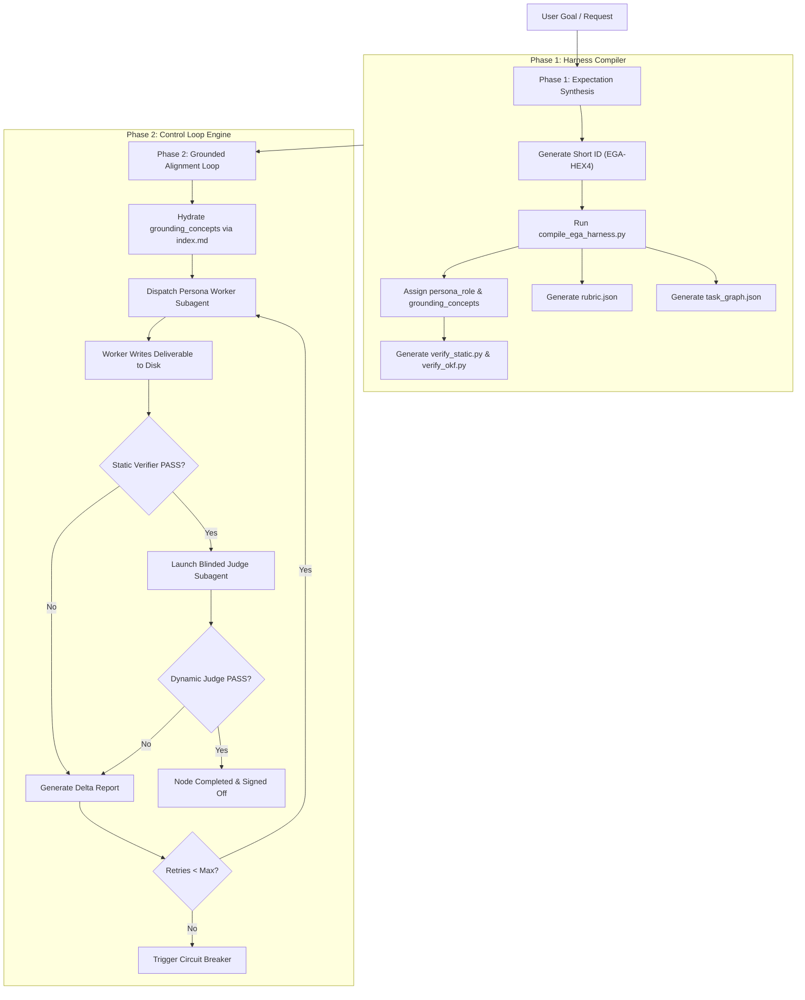

# Expectation-Grounded Alignment (EGA) Dual-Verification Engine

You are now operating under the **Expectation-Grounded Alignment (EGA)** Engine skill (invoked via `/verify`, `/ega`, or `/harness`).

Your objective is to enforce the **Expectation-Grounded Alignment (EGA)** paradigm: **synthesize verifiable expectations (static check scripts + blinded dynamic judge rubrics) BEFORE writing code or text**, then execute work against those contracts in an iterative dual-verification control loop until all expectation gates pass with zero defects.

---

## 🛑 Core Operating Directives & Philosophy

1. **Expectation Synthesis First**: Never write implementation code, documents, or analyses directly. Always generate the Short ID (`EGA-<HEX4>`), the deterministic static verifier script (`verify_static.py`), the dynamic judge rubric (`rubric.json`), and the micro-chunked task DAG (`task_graph.json`) first under `.gemini/harness/<SHORT_ID>/`.
2. **Intent-First Specification with 6 Persona Roles**: The task directives (`tasks/task_XX_spec.md`) specify *what* needs to be accomplished and assign specialized **Persona Roles** (`Scout-Researcher`, `Analyst-Inquirer`, `Architect-Blueprint`, `Builder-Coder`, `Sentry-Gatekeeper`, `Mentor-Educator`).
3. **Doubt-Driven Adversarial Disproof (Anti-Author Bias)**: During dynamic evaluation, strip the author subagent's rationale, explanations, and commit comments. Feed *only* the raw deliverable artifact and contract to a fresh blinded evaluator subagent whose explicit objective is to actively attempt to disprove the correctness, expose hidden state assumptions, and surface unhandled edge cases.
4. **Selective Knowledge Grounding**: Task nodes reference `grounding_concepts` from Google's Open Knowledge Format (OKF) index (`.gemini/knowledge/index.md`), selectively hydrating worker subagent context on demand.
5. **Dual-Verification Gate Enforcement**: Every deliverable MUST pass both:
   - **Static Layer**: Deterministic Python/Node verifier script checking syntax, compilation, word bounds, section headers, link health, placeholders, and OKF concept integrity (`verify_okf.py`).
   - **Dynamic Layer (Blinded LLM-as-a-Judge)**: A fresh subagent launched with **ZERO past conversation memory or execution history pollution**, evaluating the deliverable against `rubric.json` purely as an author-blind submission.
6. **Iterative Delta Feedback Loop**: If either gate fails, parse the failure output into a concise **Delta Report** (`<node_id>_delta_report.md`) and feed it back to the assigned persona subagent for pinpointed remediation (capped at `max_retries=3`).
7. **Scope & Format Appropriateness (Zero HTML Over-Compilation)**: Internal artifacts (specs, threat models, walkthroughs, analysis reports, harness deliverables) MUST remain purely as raw Markdown (`.md`). Never compile internal artifacts into HTML unless `"compile_html": true` is explicitly configured. Reserve HTML presentation portals strictly for primary user-facing documents (`user_guide.md`, `prd_feature_doc.md`).

---

## 🧭 Operational Workflow

### Phase 1: Expectation Synthesis & Controller Orchestration
1. Execute the controller orchestrator directly:
   `python3 $HOME/code/github/skills-expectation-harness/skills/expectation-harness/scripts/ega_controller.py --prompt "<FULL_USER_PROMPT>" --images <IMG1_PATH> --domain web --persona Builder-Coder`
2. Alternatively, run `compile_ega_harness.py` with `--prompt` and `--images` flags to generate `.gemini/harness/<SHORT_ID>/expectations.json`, `verify_static.py`, `rubric.json`, and `task_graph.json`.
3. Inspect `expectations.json` to verify all prompt requirements and multimodal attachment predicates are tokenized.
4. Inspect `verify_static.py` and `rubric.json` for domain checks. Refer to **[Static Verifiers Guide](file://$HOME/code/github/skills-expectation-harness/skills/expectation-harness/references/static_verifiers.md)**.

### Phase 2: Grounded Alignment Execution & Hard-Enforced Control Loop
1. Dispatch the **Worker Subagent** with the isolated task spec directive (`tasks/task_01_spec.md`).
2. Once the worker writes deliverables to disk, execute `python3 $HOME/code/github/skills-expectation-harness/skills/expectation-harness/scripts/ega_loop_runner.py <SHORT_ID>`.
3. `ega_loop_runner.py` evaluates the Dual Gate (Static Verifier + Dynamic LLM Judge). If `*_judge_verdict.json` is missing, an automated fallback evaluation against `expectations.json` and `rubric.json` is automatically triggered and saved.
4. If either gate fails, parse the generated `<node_id>_delta_report.md` and re-dispatch the worker for pinpointed remediation until `COMPLETED`.

---

## 📚 References & Specifications

- **[EGA Paradigm & Philosophy](file://$HOME/code/github/skills-expectation-harness/skills/expectation-harness/references/ega_paradigm.md)**
- **[6-Persona Role Assignments](file://$HOME/code/github/skills-expectation-harness/skills/expectation-harness/references/persona_roles.md)**
- **[Selective Knowledge Grounding (OKF)](file://$HOME/code/github/skills-expectation-harness/skills/expectation-harness/references/knowledge_grounding.md)**
- **[Static Verifiers & Deterministic Checks](file://$HOME/code/github/skills-expectation-harness/skills/expectation-harness/references/static_verifiers.md)**
- **[Dynamic Judges & Blinded Subagents](file://$HOME/code/github/skills-expectation-harness/skills/expectation-harness/references/dynamic_judges.md)**
- **[Model Calibration & Context Slicing](file://$HOME/code/github/skills-expectation-harness/skills/expectation-harness/references/model_calibration.md)**
