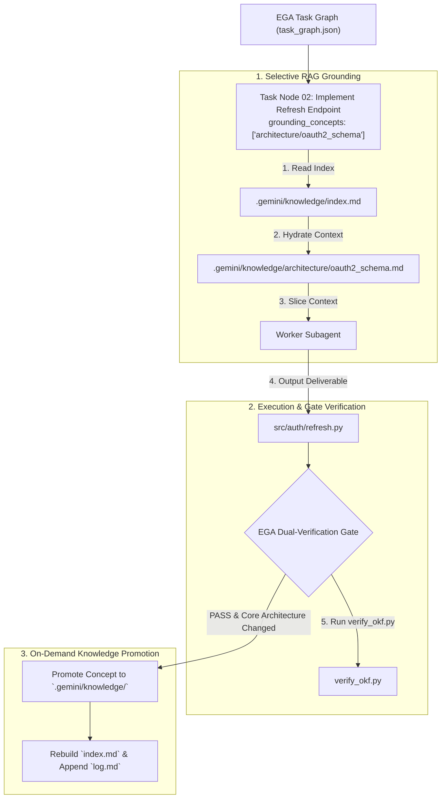

# Selective Context Grounding via Open Knowledge Format (OKF) in EGA

## Executive Overview

In **Expectation-Grounded Alignment (EGA)** (`expectation-harness`), long-running task graphs require persistent context, domain facts, environment constraints, and threat models across multiple subagent dispatches and chat sessions.

Rather than dumping entire repository documentation trees into agent system prompts, EGA incorporates Google's **Open Knowledge Format (OKF)** as an **On-Demand RAG Grounding Layer**.

---

## The 3-Phase Grounding Lifecycle



---

## 1. Selective RAG Context Grounding

In `task_graph.json`, task nodes specify a `grounding_concepts` array referencing concept IDs listed in `.gemini/knowledge/index.md`:

```json
{
  "id": "node_02_impl",
  "name": "Implement Refresh Endpoint",
  "persona_role": "Builder-Coder",
  "grounding_concepts": [
    "architecture/oauth2_schema",
    "sentry/jwt_threat_model"
  ],
  "target_artifact": "src/auth/refresh.py",
  "static_verifier": ".gemini/harness/EGA-89A1/verify_refresh.py",
  "dynamic_rubric": ".gemini/harness/EGA-89A1/rubric_refresh.json",
  "status": "PENDING"
}
```

Prior to subagent execution, EGA reads `.gemini/knowledge/index.md` and selectively view-hydrates only the concept documents specified in `grounding_concepts`.

---

## 2. Machine-Verifiable OKF Concepts (`verify_okf.py`)

When an EGA task node creates or updates an OKF concept document, EGA's static verifier runs `scripts/verify_okf.py` to enforce strict formatting:

1. **YAML Frontmatter Block**:
   ```yaml
   ---
   type: concept
   title: OAuth2 Token Refresh Schema
   description: Architecture specification for JWT token refresh rotations.
   resource: src/auth/refresh.py
   tags: [auth, jwt, security]
   timestamp: 2026-07-30T16:30:00+09:00
   ---
   ```
2. **Link Health**: Verifies that all `file://` scheme markdown links exist on disk.
3. **No Placeholders**: Rejects drafts containing `TBD`, `TODO`, or `FIXME`.

---

## 3. On-Demand Knowledge Promotion

Concept files are **not** created for routine code refactors or minor bug fixes.

Concepts are promoted to `.gemini/knowledge/` **only** when an EGA task node completes a major milestone that alters:
- Public API contracts or database schemas.
- Security threat models or token rotation policies.
- System-wide environment or deployment requirements.

Upon promotion:
1. The new concept document is written under `.gemini/knowledge/<domain>/<concept_id>.md`.
2. `.gemini/knowledge/index.md` is updated with the new concept entry.
3. `.gemini/knowledge/log.md` appends an immutable entry recording the rationale.
