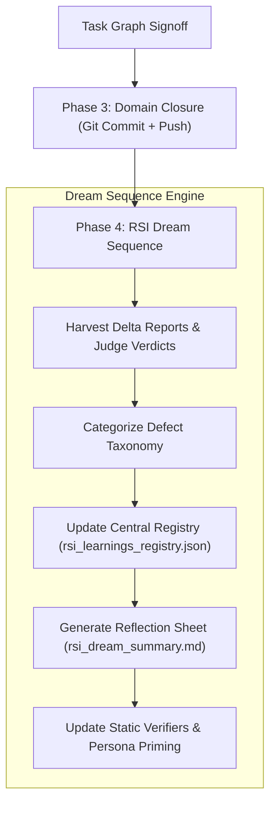

# 🔒 EGA Domain Closure & Recursive Self-Improvement (RSI) Protocol

This document defines the formal specification for **Phase 3 (Domain-Aware Full Closure)** and **Phase 4 (Recursive Self-Improvement & Dream Sequence)** under the Expectation-Grounded Alignment (EGA) Engine.

---

## 🔒 Phase 3: Domain-Aware Full Closure Engine (`ega_closure_engine.py`)

When all DAG nodes in `task_graph.json` pass the Dual-Verification Gate (Static Verifier + Blinded Dynamic Judge), `ega_loop_runner.py` automatically invokes [ega_closure_engine.py](file:///Users/ksprashanth/code/github/skills-expectation-harness/skills/expectation-harness/scripts/ega_closure_engine.py).

### Domain Closure Matrix

| Domain Category | Pre-Commit Actions | Conventional Commit Prefix | Remote Action | Manifest Output |
| :--- | :--- | :--- | :--- | :--- |
| **`python` / `node` / `coding`** | Syntax check, AST parse, unit tests | `feat(<short_id>): <goal>` | `git push origin <branch>` | `closure_manifest.json` |
| **`markdown` / `docs` / `okf`** | Broken link check, OKF index sync | `docs(<short_id>): <goal>` | `git push origin <branch>` | `closure_manifest.json` |
| **`research` / `analysis`** | Report artifact serialization | `chore(<short_id>): <goal>` | `git push origin <branch>` | `closure_manifest.json` |

### Automated Closure Steps
1. **Uncommitted Work Detection**: Runs `git status --porcelain` in the workspace root.
2. **Automated Staging**: Stages all modified and newly created files (`git add -A`).
3. **Conventional Commit**: Formats commit message: `<prefix>(<short_id>): <goal_summary>\n\nEGA Signoff`.
4. **Upstream Push**: Pushes to `origin/<current_branch>` if a git remote is configured.
5. **Closure Manifest**: Persists `closure_manifest.json` in the harness directory.

---

## 🌌 Phase 4: Recursive Self-Improvement (RSI) & Dream Sequence (`rsi_dream_engine.py`)

The **"Dream Sequence"** is the post-execution offline reflection phase where the system processes execution memory, harvests defect patterns, and fortifies future verifiers and rubrics.



### The RSI Flywheel Mechanics
1. **Defect Harvesting**: Scans `*_delta_report.md` and `*_judge_verdict.json` logs to extract exact static errors and dynamic judge defects.
2. **Central Memory Persistence**: Appends the distilled learnings entry to `.gemini/harness/rsi_learnings_registry.json`.
3. **Static Verifier Fortification**: Automatically updates `compile_ega_harness.py` so future static verifiers catch these defect patterns before code/text is written.
4. **Prompt & Rubric Calibration**: Refines persona directives and judge criteria to eliminate recurring quality regressions.

---

## 📚 Executable Commands

- **Run Full Control Loop + Closure + RSI**:
  ```bash
  python3 /Users/ksprashanth/code/github/skills-expectation-harness/skills/expectation-harness/scripts/ega_loop_runner.py <SHORT_ID>
  ```
- **Manual Domain Closure Trigger**:
  ```bash
  python3 /Users/ksprashanth/code/github/skills-expectation-harness/skills/expectation-harness/scripts/ega_closure_engine.py .gemini/harness/<SHORT_ID>
  ```
- **Manual RSI Dream Sequence Trigger**:
  ```bash
  python3 /Users/ksprashanth/code/github/skills-expectation-harness/skills/expectation-harness/scripts/rsi_dream_engine.py .gemini/harness/<SHORT_ID>
  ```
