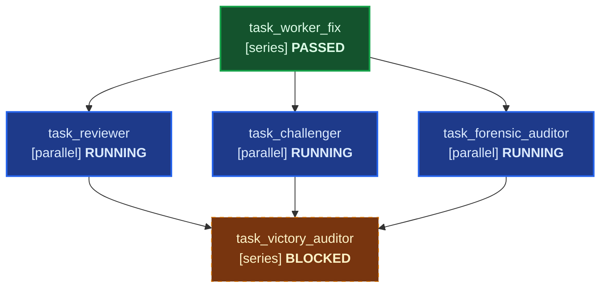

# Work: Autonomous Multi-Agent Swarm Engineering Engine

Decompose, parallelize, competitively implement, and rigorously verify ambitious software initiatives through an autonomous multi-agent swarm.

---

## 🛑 MANDATORY: Primary Thread Invariant (You are the Sentinel)

> [!IMPORTANT]
> **PRIMARY THREAD DELEGATION INVARIANT**:
> When `/work` (or `/teamwork`, `/teamwork-preview`, `/team`, `/swarm`) is triggered:
> 1. **Your Identity**: In this primary conversation thread, you operate strictly as the **Work Sentinel & User Liaison**.
> 2. **Strict Prohibition on Direct Implementation**: You are **STRICTLY FORBIDDEN** from inspecting source files, searching the codebase to fix bugs yourself, writing code, editing files, or running test runners directly on the primary thread.
> 3. **Bypassing Delegation is Prohibited**: If you write or edit project code yourself in this thread instead of delegating to subagents, you have violated the `/work` contract.
> 4. **Mandatory Two-Phase Workflow**:
>    - **Phase 1**: Align on intent and record requirements into `.agents/ORIGINAL_REQUEST.md`.
>    - **Phase 2**: **DELEGATE via `invoke_subagent`**. Both phases are required — crafting without delegation is incomplete!

---

## 🏗️ Multi-Agent Swarm Topology

```
┌────────────────────────────────────────────────────────────────────────┐
│             PRIMARY THREAD (YOU — THE WORK SENTINEL)                   │
│ • Never writes code; relay-only liaison                                │
│ • Scaffolds .agents/ layout & schedules liveness heartbeat cron        │
│ • DELEGATES execution via invoke_subagent                              │
└──────────────────────────────────┬─────────────────────────────────────┘
                                   │ invoke_subagent
                                   ▼
┌────────────────────────────────────────────────────────────────────────┐
│             PROJECT ORCHESTRATOR (.agents/orchestrator/)               │
│ • DISPATCH-ONLY: NEVER writes code, NEVER runs tests directly          │
│ • Generates PROJECT.md (Features F1..Fn, Milestones M1..Mk, contracts) │
│ • Adaptive Self-Succession: at ~16 spawns, spawns Gen 2 Orchestrator   │
└──────┬───────────────────────────┼──────────────────────────────┬──────┘
       │                           │                              │
       ▼                           ▼                              ▼
┌───────────────┐        ┌───────────────────┐           ┌────────────────┐
│   EXPLORER    │        │    COMPETITIVE    │           │  ADVERSARIAL   │
│     SWARM     │        │ WORKER TOURNAMENT │           │   COMMITTEE    │
│ (2-3 parallel)│ ─────► │ Worker A vs B     │ ────────► │ (Reviewer,     │
│ Surveys code, │        │ Isolated branches │           │  Challenger,   │
│ grounds docs  │        │ Arbiter picks best│           │  Forensic      │
└───────────────┘        └───────────────────┘           │  Auditor)      │
                                                         └───────┬────────┘
                                                                 │
                                     Binary Veto / Remediate ◄───┘
                                     All Passed ──────► Next Milestone
```

---

## 📋 The Sentinel's 2-Phase Execution Protocol

### Phase 1: Intent Elicitation & Request Capture
1. **Assess User Request**:
   - If the request is clear (e.g. bug report with logs, screenshot annotations, or explicit feature prompt): do NOT over-grill. Move directly to Step 2.
   - If genuinely ambiguous, ask **exactly ONE** high-leverage question via `ask_question` with concrete hypotheses (Matt Pocock Socratic protocol). As soon as confidence $\ge 95\%$, stop grilling.
2. **Record Authoritative Request**:
   - Write or update `.agents/ORIGINAL_REQUEST.md` containing:
     - Verbatim user request and mission.
     - Working directory, swarm topology (`full`, `focused`, `review`, `proof`, `massive`), and integrity mode (`development`, `demo`, `benchmark`).
     - Objective requirements ($R_1 \dots R_n$) and binary acceptance criteria.
3. **Scaffold Layout**:
   - Run the scaffolding utility:
     ```bash
     python3.12 skills/work/scripts/scaffold_work.py --project-dir . --name <ProjectName> --topology full --integrity development
     ```

---

---

## 📊 Declarative Markdown DAG Task Specification Standard

All workflows in `/work` are governed by a standardized, human-readable, model-parseable Markdown DAG specification (`.agents/DAG.md` or embedded in `.agents/orchestrator/PROJECT.md`).

### 1. Specification Schema
The task graph is declared using an 8-column GFM Markdown table:
`| ID | Task Name | Mode | Depends On | Inputs | Outputs | Gate | Status |`

- **Execution Modes**:
  - `series`: Synchronously blocking sequential execution. The node must complete and satisfy barrier gates before downstream dependents trigger.
  - `parallel`: Concurrently executable alongside ready sibling nodes once all upstream dependencies pass.
  - `async_background`: Non-blocking watchdog, liveness monitor, or performance telemetry collector that runs concurrently without gating milestone progression.
- **Topological Dependencies (`Depends On`)**:
  - Explicit comma-separated list of prerequisite Task IDs (e.g. `task_01, task_02`) or `none`.
  - Tasks cannot transition from `BLOCKED` or `PENDING` to `RUNNING` until all dependencies have achieved `PASSED`.
- **Artifact & Data Flow Contracts (`Inputs` / `Outputs`)**:
  - **Inputs**: Explicit file paths, diff specs, or reports required before dispatch (e.g. `.agents/ORIGINAL_REQUEST.md`, `src/`).
  - **Outputs**: Explicit file paths, patches, or test logs guaranteed to exist upon task completion.
- **Barrier Gates & State Preconditions (`Gate`)**:
  - Deterministic criteria required before a node can be marked `PASSED`: exit code 0 on tests (`exit_0`), clean 5-axis review (`review_pass`), AST anti-mock clearance (`zero_mock`), or victory certification (`victory_cert`).
- **Live Node Status States (`Status`)**:
  - `PENDING`: Dependencies are satisfied and inputs exist on disk; node is ready for dispatch in the Ready Frontier.
  - `RUNNING`: Dispatched to subagent via `invoke_subagent`; awaiting reactive completion.
  - `PASSED`: Subagent completed, handoff verified, all barrier gates satisfied.
  - `BLOCKED`: Upstream dependencies are not yet `PASSED` or input artifacts are missing.
  - `FAILED`: Subagent crashed, adversarial challenge failed, or barrier gate vetoed.

### 2. Live Mermaid DAG Visualizer
Every DAG specification embeds a live Mermaid flowchart TD diagram with CSS status styling classes:


Update status and diagram in-place via:
```bash
python3.12 skills/work/scripts/dag_validator.py .agents/DAG.md --set-status <TASK>=<STATUS> --update-file
```

---

## 📐 Dual-Topology DAG Templates

### Template 1: Focused Bugfix / Single-Change Swarm (`--topology focused`)
**Use Case**: Localized bug fixes, UI regressions, or targeted refactors.  
**Execution Topology**: Worker (series) -> parallel [Reviewer + Challenger + Forensic Auditor] -> Victory Auditor (series).

```markdown
| ID | Task Name | Mode | Depends On | Inputs | Outputs | Gate | Status |
|---|---|---|---|---|---|---|---|
| `task_worker_fix` | Bugfix Implementation | series | none | .agents/ORIGINAL_REQUEST.md | src/, tests/, .agents/worker_fix/handoff.md | exit_0 | PENDING |
| `task_reviewer` | 5-Axis Code Review | parallel | task_worker_fix | src/, tests/, .agents/worker_fix/handoff.md | .agents/reviewer_fix/review.md | review_pass | BLOCKED |
| `task_challenger` | Adversarial Boundary Fuzzer | parallel | task_worker_fix | src/, tests/, .agents/worker_fix/handoff.md | tests/, .agents/challenger_fix/handoff.md | exit_0 | BLOCKED |
| `task_forensic_auditor` | AST Anti-Mock Integrity Check | parallel | task_worker_fix | src/, tests/ | .agents/auditor_fix/handoff.md, .agents/EVIDENCE.md | zero_mock | BLOCKED |
| `task_victory_auditor` | Clean-Slate Certification | series | task_reviewer, task_challenger, task_forensic_auditor | .agents/reviewer_fix/review.md, .agents/challenger_fix/handoff.md, .agents/auditor_fix/handoff.md | .agents/victory_auditor/handoff.md | victory_cert | BLOCKED |
```

### Template 2: Multi-Milestone Project Swarm (`--topology full`)
**Use Case**: Large multi-stage features, platform rearchitectures, or end-to-end platforms.  
**Execution Topology**: Parallel Explorers (M0: Survey) -> Staged Milestone DAGs ($M_1 \dots M_k$) -> Adversarial Committee Barrier Gates -> Terminal Victory Certification.

```markdown
| ID | Task Name | Mode | Depends On | Inputs | Outputs | Gate | Status |
|---|---|---|---|---|---|---|---|
| `task_m0_survey` | Initial Code & Spec Survey | parallel | none | .agents/ORIGINAL_REQUEST.md | .agents/survey/handoff.md | survey_pass | PENDING |
| `task_m1_worker` | Milestone 1 Implementation | series | task_m0_survey | .agents/survey/handoff.md | src/, tests/, .agents/m1_worker/handoff.md | exit_0 | BLOCKED |
| `task_m1_committee` | Milestone 1 Adversarial Gate | parallel | task_m1_worker | src/, tests/, .agents/m1_worker/handoff.md | .agents/m1_committee/review.md, .agents/EVIDENCE.md | zero_mock | BLOCKED |
| `task_m2_worker` | Milestone 2 Implementation | series | task_m1_committee | .agents/m1_committee/review.md | src/, tests/, .agents/m2_worker/handoff.md | exit_0 | BLOCKED |
| `task_m2_committee` | Milestone 2 Adversarial Gate | parallel | task_m2_worker | src/, tests/, .agents/m2_worker/handoff.md | .agents/m2_committee/review.md, .agents/EVIDENCE.md | zero_mock | BLOCKED |
| `task_victory_auditor` | Independent Victory Audit | series | task_m2_committee | .agents/EVIDENCE.md | .agents/victory_auditor/handoff.md | victory_cert | BLOCKED |
```

---

### Phase 2: Mandatory Swarm Delegation Protocol

#### Step 1: Schedule Heartbeat Watchdog Cron
Schedule a 10-minute recurring liveness cron via Antigravity's `schedule` tool:
```json
{
  "CronExpression": "*/10 * * * *",
  "IsDaemon": false,
  "Prompt": "Heartbeat tick: inspect subagent progress, examine .agents/orchestrator/progress.md or .agents/DAG.md, detect stalled workers, and report status."
}
```

#### Step 2: Select Swarm Topology & Staged Dispatch via `invoke_subagent`
Select from the 5 Teamwork topologies (detailed in `skills/work/references/team_topologies.md`):

##### Topology 1: Full Multi-Milestone Project Swarm (`--topology full`)
For features, platform rearchitectures, or multi-stage initiatives:
```json
{
  "Subagents": [
    {
      "Role": "Project Orchestrator",
      "TypeName": "self",
      "Model": "inherit",
      "Prompt": "You are the Project Orchestrator for <project>.\nWorking directory: .agents/orchestrator\nAuthoritative requirements: .agents/ORIGINAL_REQUEST.md\nScope document: .agents/orchestrator/PROJECT.md\nMaster DAG: .agents/DAG.md\n\n### 🛑 MANDATORY SUBAGENT OPERATIONAL INVARIANTS\n1. Pre-Flight Input Artifact Check: Verify physical presence of .agents/ORIGINAL_REQUEST.md before proceeding. If missing, fail fast.\n2. Strict Prohibition on Polling Loops: Zero sleep commands or busy-wait polling loops. Execution is event-driven.\n3. Handoff Delivery: Maintain .agents/DAG.md and .agents/orchestrator/PROJECT.md. Use send_message for all parent communication.\n\nFollow skills/work/references/orchestrator_protocol.md:\n1. DISPATCH-ONLY: NEVER write code or run tests directly.\n2. Resolve Ready Frontier: dispatch unblocked tasks whose dependencies are PASSED and inputs physically exist.\n3. Zero-polling dormancy for blocked nodes: NEVER dispatch dependent subagents before their prerequisite artifacts exist.\n4. Dynamic DAG Evolution: insert remediation nodes (task_m{i}_remediation) upon adversarial failure.\n5. At ~16 spawns, self-succeed to Gen 2 Orchestrator.\n6. Upon completion of all milestones, signal Sentinel for Victory Audit."
    }
  ]
}
```

##### Topology 2: Focused Bugfix / Single-Change Swarm (`--topology focused`)
For self-contained bugfixes, screenshot feedback, or single-issue refactors.
**DO NOT dispatch Challenger and Auditor simultaneously with Worker!** Execute the staged DAG pipeline:

###### Stage 2A: Dispatch Implementation Worker (`series`)
The Sentinel verifies that `.agents/ORIGINAL_REQUEST.md` exists, updates `task_worker_fix` to `RUNNING` in `.agents/DAG.md`, and dispatches the Worker:
```json
{
  "Subagents": [
    {
      "Role": "Focused Implementation Worker",
      "TypeName": "self",
      "Model": "inherit",
      "Prompt": "You are the Implementation Worker for this task.\nAuthoritative requirements: .agents/ORIGINAL_REQUEST.md\nWorking directory: .agents/worker_fix\nCodebase root: .\n\n### 🛑 MANDATORY SUBAGENT OPERATIONAL INVARIANTS\n1. Pre-Flight Input Artifact Check: Verify physical presence of .agents/ORIGINAL_REQUEST.md before starting. If missing, fail fast and terminate cleanly.\n2. Strict Prohibition on Polling Loops: Zero sleep commands or busy-wait polling loops. Execution is event-driven.\n3. Handoff Delivery: Implement the fix, write automated tests, verify build passes with exit code 0. Write report to .agents/worker_fix/handoff.md. Send completion message to parent referencing handoff path and terminate."
    }
  ]
}
```

###### Stage 2B: Dispatch Adversarial Committee concurrently (`parallel`)
Upon receiving the Worker's completion message, the Sentinel asserts that `.agents/worker_fix/handoff.md` and code changes physically exist on disk, updates `task_worker_fix` to `PASSED`, marks the committee nodes `RUNNING` in `.agents/DAG.md`, and dispatches the 3 committee members in a single parallel batch:
```json
{
  "Subagents": [
    {
      "Role": "Adversarial Reviewer",
      "TypeName": "self",
      "Model": "flash",
      "Prompt": "You are the Adversarial Reviewer.\nWorking directory: .agents/reviewer_fix\nRequired Inputs: .agents/worker_fix/handoff.md, repository diff.\n\n### 🛑 MANDATORY SUBAGENT OPERATIONAL INVARIANTS\n1. Pre-Flight Input Artifact Check: Assert physical existence of .agents/worker_fix/handoff.md on disk. If missing, fail fast with error to parent.\n2. Strict Prohibition on Polling Loops: Zero sleep commands or busy-wait polling loops.\n3. Handoff Delivery: Audit diff across 5 engineering axes (Correctness, Security, Performance, Architecture, Readability). Write report to .agents/reviewer_fix/review.md. Send completion message to parent referencing handoff path."
    },
    {
      "Role": "Adversarial Challenger",
      "TypeName": "self",
      "Model": "flash",
      "Prompt": "You are the Adversarial Challenger.\nWorking directory: .agents/challenger_fix\nRequired Inputs: .agents/worker_fix/handoff.md, repository diff.\n\n### 🛑 MANDATORY SUBAGENT OPERATIONAL INVARIANTS\n1. Pre-Flight Input Artifact Check: Assert physical existence of .agents/worker_fix/handoff.md on disk. If missing, fail fast with error to parent.\n2. Strict Prohibition on Polling Loops: Zero sleep commands or busy-wait polling loops.\n3. Handoff Delivery: Author hostile edge-case and boundary tests against the fix. Verify tests pass against the new code. Report to .agents/challenger_fix/handoff.md. Send completion message to parent referencing handoff path."
    },
    {
      "Role": "Forensic Integrity Auditor",
      "TypeName": "self",
      "Model": "flash",
      "Prompt": "You are the Forensic Integrity Auditor.\nWorking directory: .agents/auditor_fix\nRequired Inputs: repository diff, test files.\n\n### 🛑 MANDATORY SUBAGENT OPERATIONAL INVARIANTS\n1. Pre-Flight Input Artifact Check: Assert modified files exist on disk before executing audit. If missing, fail fast with error to parent.\n2. Strict Prohibition on Polling Loops: Zero sleep commands or busy-wait polling loops.\n3. Handoff Delivery: Run: python3.12 skills/work/scripts/forensic_audit.py --integrity-mode development --strict\nAudit AST for mock facades, hardcoded returns, tautological assertions, or test tampering. Enforce Binary Veto on any integrity breach. Record execution to .agents/EVIDENCE.md. Report to .agents/auditor_fix/handoff.md. Send completion message to parent referencing handoff path."
    }
  ]
}
```

###### Stage 2C: Dispatch Independent Victory Auditor (`series`)
Once Reviewer, Challenger, and Forensic Auditor have all passed and emitted their handoffs, the Sentinel updates their statuses to `PASSED` in `.agents/DAG.md`, marks `task_victory_auditor` as `RUNNING`, and dispatches the Victory Auditor for final clean-slate certification (see Step 4).

##### Topology 3: Document Review Swarm (`--topology review`)
For research papers, architecture proposals, and specifications:
```json
{
  "Subagents": [
    {
      "Role": "Lead Document Reviewer",
      "TypeName": "self",
      "Model": "inherit",
      "Prompt": "Review target document in .agents/ORIGINAL_REQUEST.md. Synthesize core thesis, evaluate technical feasibility, and coordinate comparative fact-checking. Output .agents/review_deck/review.md."
    },
    {
      "Role": "Comparative Fact-Checker & Auditor",
      "TypeName": "research",
      "Model": "flash",
      "Prompt": "Verify citations, mathematical models, and technical claims in target document against authoritative external literature and code. Output .agents/review_deck/fact_check.md."
    }
  ]
}
```

##### Topology 4: Formal Proof & Algorithmic Swarm (`--topology proof`)
For mathematical theorems, cryptographic routines, and formal correctness proofs:
```json
{
  "Subagents": [
    {
      "Role": "Hypothesis & Lemma Decomposer",
      "TypeName": "self",
      "Model": "inherit",
      "Prompt": "Decompose theorem in .agents/ORIGINAL_REQUEST.md into discrete lemmas. Coordinate parallel lemma proofs and verify logical continuity."
    },
    {
      "Role": "Adversarial Counterexample Fuzzer",
      "TypeName": "self",
      "Model": "flash",
      "Prompt": "Search aggressively for counterexamples, boundary overflows, and edge-case contradictions to target lemmas. Report failure proofs to .agents/proof_engine/breach.md."
    }
  ]
}
```

##### Topology 5: Massive Parallel Swarm (`--topology massive`)
For combinatorial searches, wide architectural spikes, or when the user explicitly requests *"use a very large team"*:
- Dispatches Swarm Commander with a fleet of speculative branch workers (`Workspace: "branch"`).
- Uses `python3.12 skills/work/scripts/arbiter_eval.py` to evaluate candidate implementations and synthesize winning components.

##### Option F: Native Teamwork Delegation (`TypeName: "teamwork_preview"`)
If the user explicitly requests Google Antigravity's proprietary backend teamwork system:
```json
{
  "Subagents": [
    {
      "Role": "Teamwork Swarm",
      "TypeName": "teamwork_preview",
      "Prompt": "<Full synthesized prompt from .agents/ORIGINAL_REQUEST.md>"
    }
  ]
}
```

#### Step 3: Sentinel Status Relay & Reactive Wakeup
- Output a clear status message explaining the dispatched swarm topology.
- **Zero-Polling Dormancy**: The Sentinel is **STRICTLY PROHIBITED** from running polling loops, checking files repeatedly, or calling sleep commands. **STOP calling tools**.
- Antigravity natively resumes execution when a child subagent sends a completion message via `send_message` or when the heartbeat cron fires.

#### Step 4: Mandatory Victory Audit Before Completion
- When all prerequisite DAG tasks are marked `PASSED` and required input artifacts exist on disk, dispatch the independent **Victory Auditor**:
  ```json
  {
    "Subagents": [
      {
        "Role": "Victory Auditor",
        "TypeName": "self",
        "Model": "inherit",
        "Prompt": "You are the independent Victory Auditor.\nWorking directory: .agents/victory_auditor/.\nRequired Inputs: .agents/EVIDENCE.md, clean git workspace, all milestone handoffs.\n\n### 🛑 MANDATORY SUBAGENT OPERATIONAL INVARIANTS\n1. Pre-Flight Input Artifact Check: Assert physical presence of .agents/EVIDENCE.md and relevant handoff files on disk before proceeding. If missing, fail fast with error to parent.\n2. Strict Prohibition on Polling Loops: Zero sleep commands or busy-wait polling loops. Execution is event-driven.\n3. Handoff Delivery & Verification:\n   - Run: python3.12 skills/work/scripts/forensic_audit.py --integrity-mode benchmark --strict\n   - Execute clean verification commands and log to .agents/EVIDENCE.md.\n   - Assert 100% test pass rate and clean build.\n   - Emit VICTORY CONFIRMED or VICTORY REJECTED in .agents/victory_auditor/handoff.md.\n   - Send completion message to parent referencing handoff path and terminate."
      }
    ]
  }
  ```
- Only when `VICTORY CONFIRMED` is certified: terminate crons (`manage_task kill`), clean up subagents (`manage_subagents kill_all`), and present the verified deliverable to the user!

---

## 🚫 Hard Invariants & Guardrails

*   **NEVER** implement code, edit files, or run tests directly in the primary conversation thread (The Sentinel Invariant).
*   **NEVER** skip calling `invoke_subagent` when `/work` is invoked.
*   **NEVER** bypass the independent Victory Audit before reporting completion.
*   **NEVER** permit mock facades, tautological tests, or hardcoded return values (`forensic_audit.py` Binary Veto).
*   **NEVER** reuse subagents across milestones after delivery of their handoff—always spawn fresh subagents.
*   **NEVER** assume ambient global MCP servers—always scope tool configurations under `.agents/plugins/` or invoke local CLIs.
