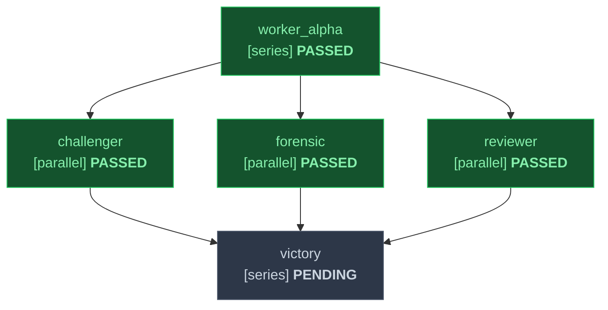

# Focused Bugfix DAG Specification

## Task Graph
| ID | Title | Mode | Depends On | Inputs | Outputs | Gate | Status |
|---|---|---|---|---|---|---|---|
| worker_alpha | Implement Fix | series | none | ORIGINAL_REQUEST.md | src/fix.py | test_pass | PASSED |
| reviewer | Code & Arch Review | parallel | worker_alpha | src/fix.py | .agents/reviewer/report.md | exit_0 | PASSED |
| challenger | Adversarial Test Challenge | parallel | worker_alpha | src/fix.py | .agents/challenger/report.md | exit_0 | PASSED |
| forensic | AST Anti-Mock Audit | parallel | worker_alpha | src/fix.py | .agents/forensic/report.md | zero_mock | PASSED |
| victory | Victory Certification | series | reviewer, challenger, forensic | .agents/reviewer/report.md, .agents/challenger/report.md, .agents/forensic/report.md | .agents/sentinel/VICTORY.md | all_passed | PENDING |

