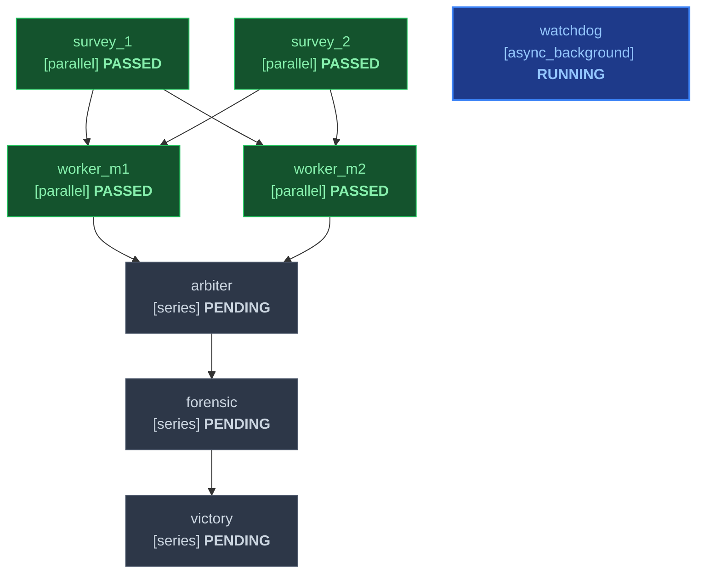

# Multi-Milestone Swarm DAG Specification

## Task Graph
| ID | Title | Mode | Depends On | Inputs | Outputs | Gate | Status |
|---|---|---|---|---|---|---|---|
| survey_1 | Codebase Survey | parallel | none | ORIGINAL_REQUEST.md | .agents/survey_1/report.md | file_exists | PASSED |
| survey_2 | Architectural Survey | parallel | none | ORIGINAL_REQUEST.md | .agents/survey_2/report.md | file_exists | PASSED |
| worker_m1 | DAG Harness Implementer | parallel | survey_1, survey_2 | .agents/survey_1/report.md | skills/work/scripts/dag_validator.py | exit_0 | PASSED |
| worker_m2 | Markdown Schema Implementer | parallel | survey_1, survey_2 | .agents/survey_2/report.md | skills/plan/SKILL.md | exit_0 | PASSED |
| watchdog | Liveness Watchdog | async_background | none | none | .agents/sentinel/progress.md | none | RUNNING |
| arbiter | Integration Arbiter | series | worker_m1, worker_m2 | skills/work/scripts/dag_validator.py | .agents/arbiter/scorecard.md | exit_0 | PENDING |
| forensic | AST Integrity Audit | series | arbiter | skills/work/scripts/dag_validator.py | .agents/forensic/report.md | zero_mock | PENDING |
| victory | Swarm Certification | series | forensic | .agents/forensic/report.md | .agents/sentinel/VICTORY.md | all_passed | PENDING |

