# 🎨 Visual Production Guide: Mermaid Architecture Standards & Generative UI Simulators

Authoritative visual production guide for `/work` swarms, design architects, and verification auditors.
This document defines standard-compliant Mermaid diagram templates across primary software archetypes, Antigravity Generative UI standards for interactive "What-If" trade-off simulators, and a visual review quality checklist.

---

## 1. Universal Mermaid Syntax Invariants & Escaping Discipline

All Mermaid diagrams authored in `/work` design proposals (`proposal_alpha.md`, `proposal_beta.md`), authoritative designs (`DESIGN.md`), and task graphs (`DAG.md`) must adhere to strict escaping and formatting rules to prevent syntax crashes across markdown parsers and Antigravity preview panes.

### 1.1 Mandatory Node Quoting Invariant
Every node label containing spaces, hyphens, slashes, brackets `[]`, parentheses `()`, or punctuation **MUST** be enclosed in explicit double quotes:

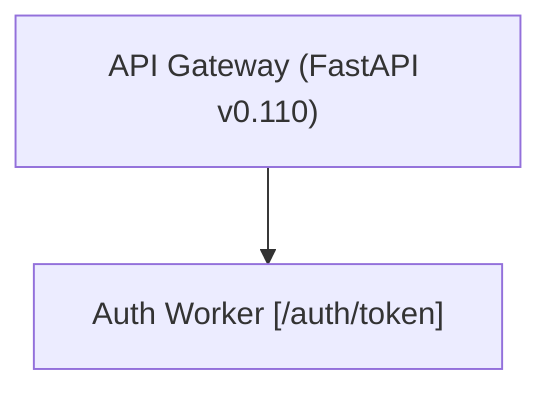

```mermaid
%% INCORRECT: Unquoted parentheses or brackets break Mermaid parsing
flowchart TD
  node_a[API Gateway (FastAPI)] --> node_b[Auth Worker [/auth/token]]
```

### 1.2 Entity Escaping Matrix
When generating diagrams via scripts or LLM prompts, apply the following deterministic substitutions:

| Character / Token | Raw Syntax | Escaped Entity | Rationale |
|---|---|---|---|
| **Double Quote** | `"` | `#quot;` | Prevents premature string termination in node definitions |
| **Arrow Token** | `-->` / `==>` | `--&gt;` / `==&gt;` | Prevents Mermaid edge parser from misidentifying label text as edge syntax |
| **Pipe / Delimiter** | `\|` | `&#124;` | Avoids collision with Mermaid edge label syntax `\|label\|` |
| **Ampersand** | `&` | `&amp;` | Standard XML/HTML entity escaping |
| **Newline** | `\n` | `<br/>` | Formats multiline descriptions cleanly inside node boxes |
| **HTML Script Tags** | `<script>...</script>` | *STRIPPED* | Security invariant; prevents script injection |

### 1.3 Recommended Mermaid Class & Theme Palette
Use accessible, high-contrast dark/light palette classes for clear architectural layer distinctions:

```mermaid
classDef edge fill:#1e293b,stroke:#3b82f6,stroke-width:2px,color:#f8fafc;
classDef core fill:#0f172a,stroke:#6366f1,stroke-width:2px,color:#f8fafc;
classDef storage fill:#064e3b,stroke:#10b981,stroke-width:2px,color:#ecfdf5;
classDef queue fill:#701a75,stroke:#d946ef,stroke-width:2px,color:#fdf4ff;
classDef guard fill:#7f1d1d,stroke:#ef4444,stroke-width:2px,color:#fef2f2;
```

---

## 2. Complete Diagram Templates by Software Archetype

### Archetype 1: Microservices Architecture

#### 1. System Architecture (`flowchart TD`)
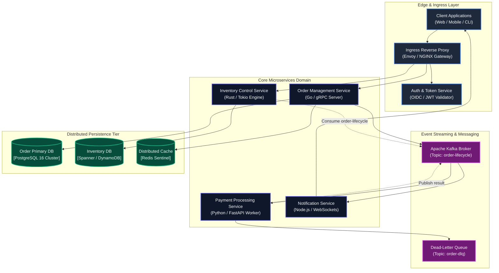

#### 2. C4 Level 2/3 Component Block Diagram (`graph TD`)
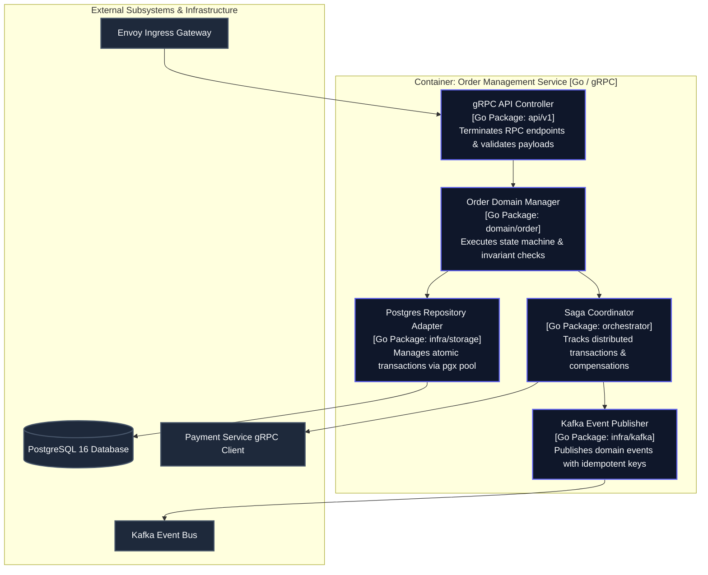

#### 3. Lifecycle Sequence Diagram (`sequenceDiagram`)
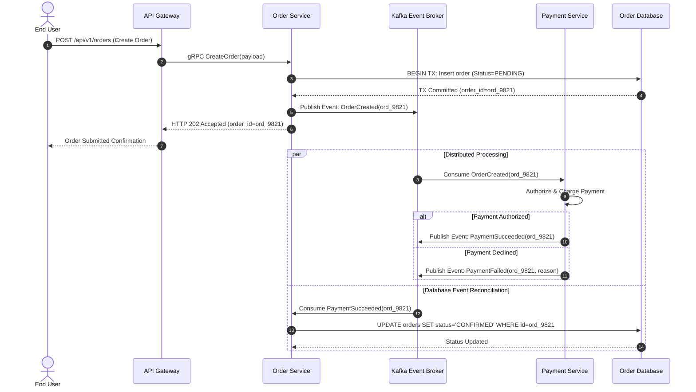

---

### Archetype 2: CLI Engine Architecture

#### 1. System Architecture (`flowchart TD`)
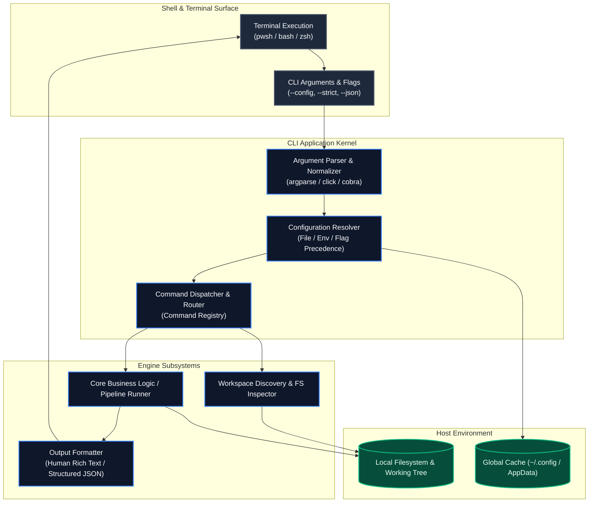

#### 2. C4 Level 2/3 Component Block Diagram (`graph TD`)
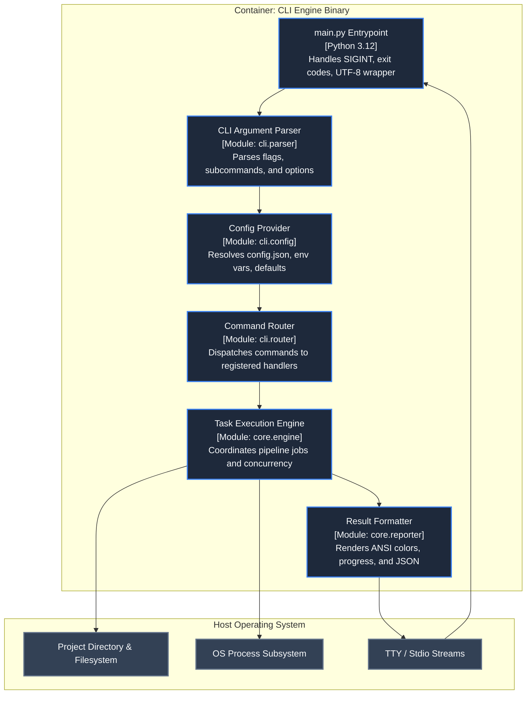

#### 3. Lifecycle Sequence Diagram (`sequenceDiagram`)
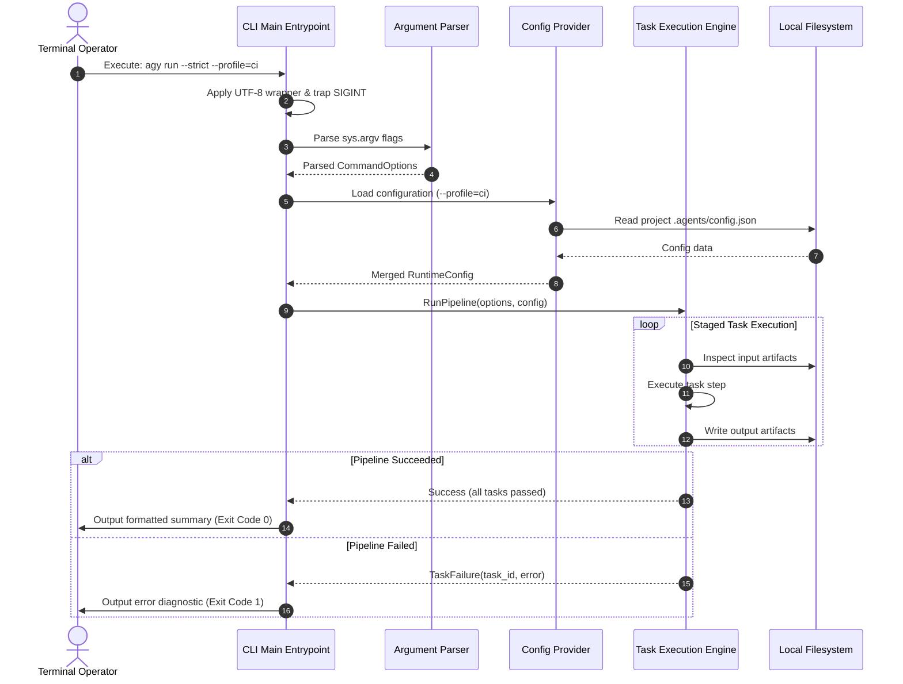

---

### Archetype 3: Pipeline / ETL Streaming Architecture

#### 1. System Architecture (`flowchart TD`)
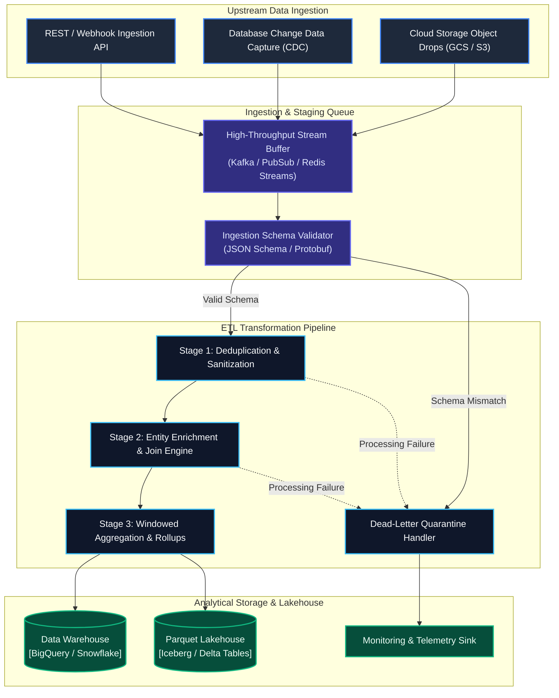

#### 2. C4 Level 2/3 Component Block Diagram (`flowchart LR`)
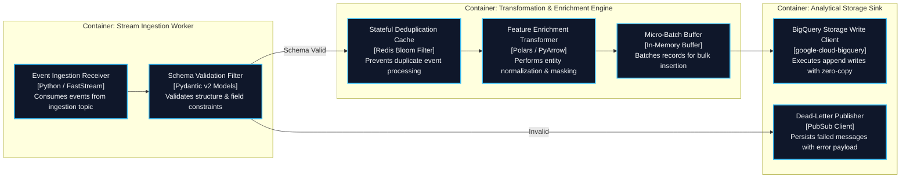

#### 3. Lifecycle Sequence Diagram (`sequenceDiagram`)
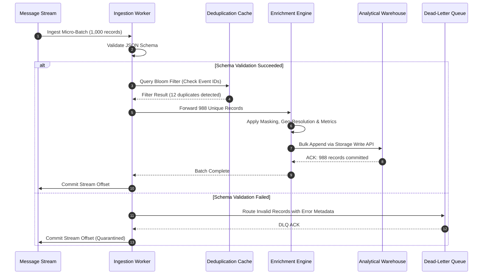

---

### Archetype 4: Client-Server Web Architecture

#### 1. System Architecture (`flowchart TD`)
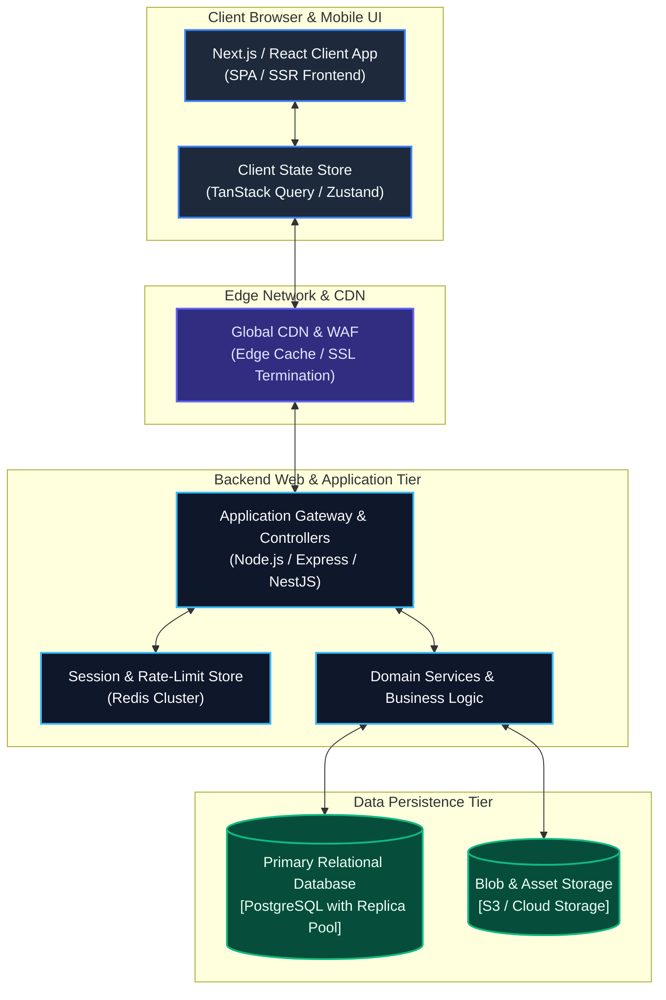

#### 2. C4 Level 2/3 Component Block Diagram (`graph TD`)
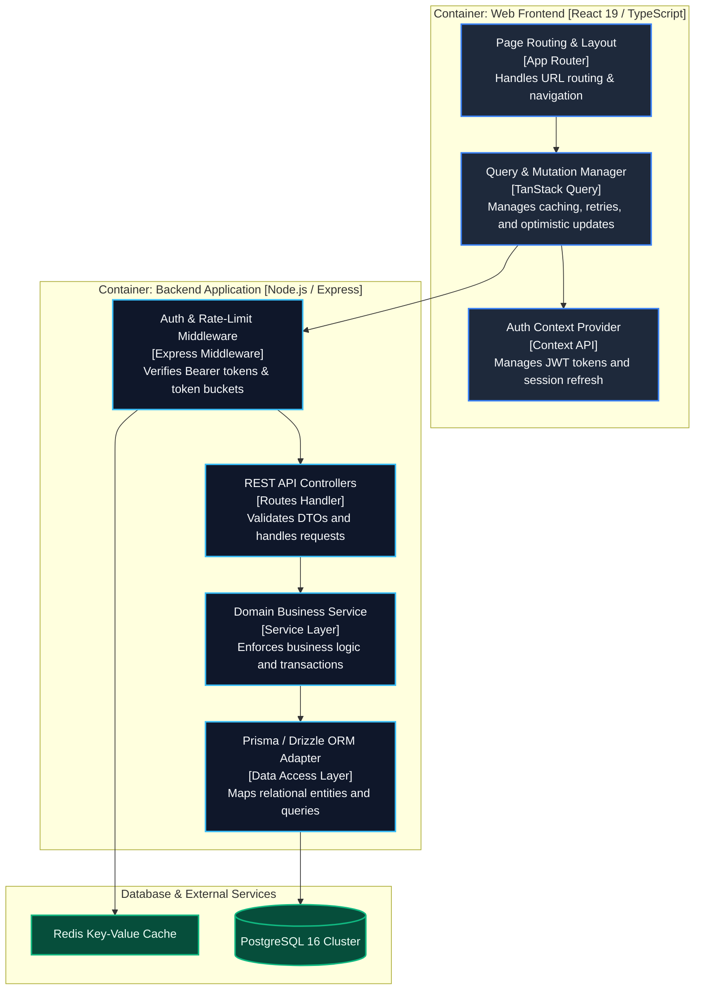

#### 3. Lifecycle Sequence Diagram (`sequenceDiagram`)
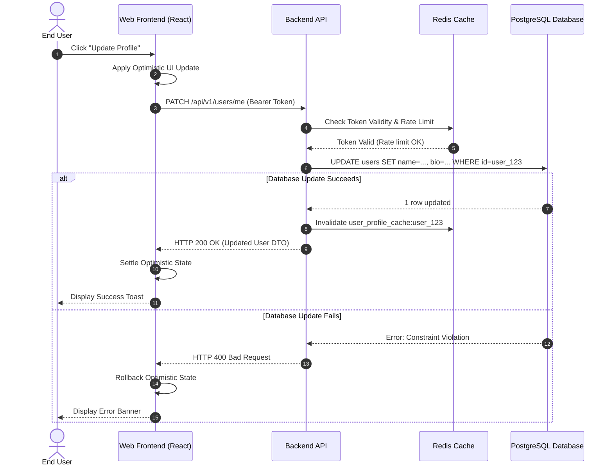

---

## 3. Antigravity Generative UI Standards: "What-If" Simulators

When parallel design proposals reveal genuine architectural trade-offs, the Architectural Arbiter and Sentinel compile an interactive **What-If Architectural Trade-Off Simulator** (`.agents/design/what_if_simulator.html`).

### 3.1 Core Architecture & Sandboxing Invariants
1. **Self-Contained Single-File HTML5 Artifact**:
   - The entire simulator is packaged into a single HTML file containing HTML markup, scoped CSS styling, native JavaScript logic, and embedded JSON manifest state.
2. **Zero External CDN Dependencies (Strict CSP Audit)**:
   - Antigravity Generative UI artifacts execute in sandboxed iframes.
   - **PROHIBITED**: Unapproved external CDNs (`cdn.jsdelivr.net`, `cdnjs.cloudflare.com`, `unpkg.com`, external fonts, Chart.js, D3.js).
   - **PERMITTED**: Native HTML5 Canvas 2D, browser DOM APIs, and Google Antigravity approved local web runtime (`https://www.gstatic.com/antigravity/web/dev/tailwindcss.min.js` with pure CSS fallbacks).
3. **Headless & Non-JS Fallback Invariant**:
   - Every simulator artifact **MUST** include a `<noscript>` block containing a pre-rendered static HTML trade-off comparison matrix.
   - Automated CI scripts, test runners, and text-only agents can inspect all dimensions and profiles without evaluating JavaScript.

### 3.2 HTML5 Canvas 2D Retina Radar Engine
To achieve crisp rendering on high-DPI (Retina, 4K) displays with zero external graphing dependencies, radar charts are implemented using the HTML5 Canvas 2D API with explicit buffer scaling:

```javascript
/**
 * Vector-Grade Canvas 2D Radar Renderer with Retina Scaling
 */
function renderRadar(canvas, dimensions, values, benchmarkValues) {
  const ctx = canvas.getContext('2d');
  const dpr = window.devicePixelRatio || 1;
  const rect = canvas.getBoundingClientRect();

  // Scale internal buffer dimensions to match device pixel density
  canvas.width = rect.width * dpr;
  canvas.height = rect.height * dpr;
  ctx.scale(dpr, dpr);

  const width = rect.width;
  const height = rect.height;
  const centerX = width / 2;
  const centerY = height / 2;
  const radius = Math.min(centerX, centerY) - 40;
  const totalAxes = dimensions.length;

  ctx.clearRect(0, 0, width, height);

  // 1. Draw Concentric Polygonal Background Grids (20%, 40%, 60%, 80%, 100%)
  const levels = 5;
  for (let level = 1; level <= levels; level++) {
    const levelRadius = (radius / levels) * level;
    ctx.beginPath();
    for (let i = 0; i < totalAxes; i++) {
      const angle = (Math.PI * 2 / totalAxes) * i - Math.PI / 2;
      const x = centerX + levelRadius * Math.cos(angle);
      const y = centerY + levelRadius * Math.sin(angle);
      if (i === 0) ctx.moveTo(x, y);
      else ctx.lineTo(x, y);
    }
    ctx.closePath();
    ctx.strokeStyle = "rgba(148, 163, 184, 0.15)";
    ctx.lineWidth = 1;
    ctx.stroke();
  }

  // 2. Draw Radial Axes & Axis Labels
  for (let i = 0; i < totalAxes; i++) {
    const angle = (Math.PI * 2 / totalAxes) * i - Math.PI / 2;
    const x = centerX + radius * Math.cos(angle);
    const y = centerY + radius * Math.sin(angle);
    ctx.beginPath();
    ctx.moveTo(centerX, centerY);
    ctx.lineTo(x, y);
    ctx.strokeStyle = "rgba(148, 163, 184, 0.25)";
    ctx.stroke();

    // Text Label Positioning
    const labelX = centerX + (radius + 22) * Math.cos(angle);
    const labelY = centerY + (radius + 18) * Math.sin(angle);
    ctx.fillStyle = "rgba(226, 232, 240, 0.85)";
    ctx.font = "11px system-ui, sans-serif";
    ctx.textAlign = "center";
    ctx.textBaseline = "middle";
    ctx.fillText(dimensions[i].name, labelX, labelY);
  }

  // 3. Draw Polygon for Recommended Baseline (Emerald Fill)
  if (benchmarkValues) {
    drawPolygon(ctx, centerX, centerY, radius, dimensions, benchmarkValues, "rgba(16, 185, 129, 0.2)", "rgba(16, 185, 129, 0.8)", 1.5);
  }

  // 4. Draw Polygon for Active Configuration (Blue Fill)
  drawPolygon(ctx, centerX, centerY, radius, dimensions, values, "rgba(59, 130, 246, 0.35)", "rgba(59, 130, 246, 0.9)", 2.5);
}

function drawPolygon(ctx, centerX, centerY, radius, dimensions, values, fillColor, strokeColor, lineWidth) {
  const totalAxes = dimensions.length;
  ctx.beginPath();
  for (let i = 0; i < totalAxes; i++) {
    const dim = dimensions[i];
    const val = values[dim.id] !== undefined ? values[dim.id] : dim.defaultValue;
    // Normalize value to 0.0 .. 1.0 range
    const ratio = Math.max(0, Math.min(1, (val - dim.min) / (dim.max - dim.min)));
    const angle = (Math.PI * 2 / totalAxes) * i - Math.PI / 2;
    const x = centerX + radius * ratio * Math.cos(angle);
    const y = centerY + radius * ratio * Math.sin(angle);
    if (i === 0) ctx.moveTo(x, y);
    else ctx.lineTo(x, y);
  }
  ctx.closePath();
  ctx.fillStyle = fillColor;
  ctx.fill();
  ctx.strokeStyle = strokeColor;
  ctx.lineWidth = lineWidth;
  ctx.stroke();
}
```

### 3.3 Markdown Choice-Card Clipboard Export
The simulator includes an export button that compiles user slider adjustments into a structured GitHub Flavored Markdown block ready for the Sentinel's `ask_question` tool:

```javascript
function exportDecisionMarkdown() {
  const profileName = state.profiles[state.activeProfileId]?.name || "Custom Configuration";
  let md = `### Architectural Decision Choice Card: ${profileName}\n\n`;
  md += `| Dimension | Selected Value | Target Range | Unit |\n`;
  md += `|---|---|---|---|\n`;
  for (const dim of state.dimensions) {
    const val = state.values[dim.id];
    md += `| **${dim.name}** | \`${val}\` | ${dim.min} – ${dim.max} | ${dim.unit} |\n`;
  }
  md += `\n**Composite System Score**: \`${calculateScore().toFixed(1)} / 100\`\n`;

  navigator.clipboard.writeText(md).then(() => {
    showExportConfirmation();
  });
}
```

---

## 4. Visual Production Quality Checklist

Before approving proposals, committing `DESIGN.md`, or passing Phase 7 verification, design reviewers and auditors must evaluate diagrams against this 10-point checklist:

### Syntax & Escaping Checklist
- [ ] **1. Quoting Invariant**: Are all Mermaid node labels containing spaces, brackets, parentheses, slashes, or hyphens enclosed in explicit double quotes (`id["Text"]`)?
- [ ] **2. Clean Entities**: Are internal quotes (`#quot;`), edge labels (`&#124;`), and arrow characters (`--&gt;`) properly escaped?
- [ ] **3. Direction & Type Directives**: Does every diagram begin with a standard directive (`flowchart TD`, `graph TD`, `sequenceDiagram`)?
- [ ] **4. Autonumber on Sequences**: Do all `sequenceDiagram` definitions specify `autonumber` on line 2 for traceability?

### Architectural Rigor Checklist
- [ ] **5. C4 Boundary Purity**: Do C4 component diagrams group elements inside subgraphs that represent authentic process or network boundaries (Containers / Services)?
- [ ] **6. Complete Archetype Representation**: Does the proposal contain all three mandatory visual views:
  - System Architecture Overview (`flowchart TD`)
  - C4 Component Block Diagram (`graph TD` / `flowchart LR`)
  - Lifecycle Sequence Diagram (`sequenceDiagram`)?
- [ ] **7. Parity with Declarative Contracts**: Do the component IDs in diagrams match the package, class, or service names defined in TypeScript/Python interface sections?

### Generative UI Simulator Checklist
- [ ] **8. Zero-CDN Sandboxing**: Does `what_if_simulator.html` run 100% offline without external CDN script tags (no unapproved Chart.js/D3/fonts)?
- [ ] **9. High-DPI Vector Crispness**: Does the radar canvas implement `window.devicePixelRatio` scaling so polygons render sharply on Retina screens?
- [ ] **10. Headless `<noscript>` Fallback**: Does the HTML file include a pre-rendered static comparison table inside `<noscript>` for headless testing environments?
