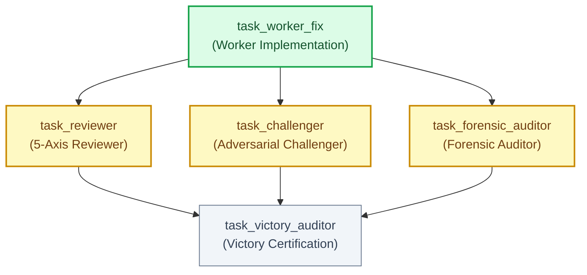

# Declarative DAG: Focused Bugfix Swarm

Topology: focused
Integrity Mode: development
Target Issue: Fix JSON deserialization crash on malformed payloads

---

## 📊 Live Mermaid Execution Topology

---

## 📋 Declarative Task Graph Table

| ID | Task Name | Mode | Depends On | Inputs | Outputs | Gate | Status |
|---|---|---|---|---|---|---|---|
| `task_worker_fix` | Bugfix Implementation | series | none | ORIGINAL_REQUEST.md | src/parser.py, tests/test_parser.py, .agents/worker_fix/handoff.md | pytest tests/test_parser.py | PASSED |
| `task_reviewer` | 5-Axis Reviewer | parallel | task_worker_fix | src/parser.py, .agents/worker_fix/handoff.md | .agents/reviewer_fix/review.md | review_pass | RUNNING |
| `task_challenger` | Adversarial Boundary Fuzzer | parallel | task_worker_fix | src/parser.py, tests/test_parser.py | tests/test_hostile.py, .agents/challenger_fix/handoff.md | pytest tests/test_hostile.py | RUNNING |
| `task_forensic_auditor` | AST Anti-Mock Integrity Check | parallel | task_worker_fix | src/parser.py, tests/test_parser.py | .agents/auditor_fix/handoff.md, .agents/EVIDENCE.md | zero_mock | RUNNING |
| `task_victory_auditor` | Clean-Slate Certification | series | task_reviewer, task_challenger, task_forensic_auditor | .agents/reviewer_fix/review.md, .agents/challenger_fix/handoff.md, .agents/auditor_fix/handoff.md | .agents/victory_auditor/handoff.md | victory_gate | PENDING |
