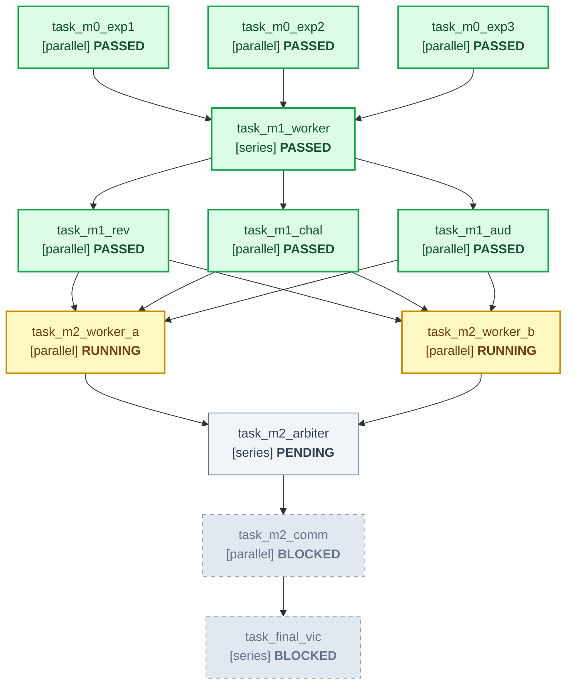

# Declarative Master DAG: Multi-Milestone Swarm

Topology: full
Integrity Mode: development
Project: Cloud-Native Event Streaming Engine

---

## 📊 Live Mermaid Execution Topology

---

## 📋 Declarative Task Graph Table

| ID | Task Name | Mode | Depends On | Inputs | Outputs | Gate | Status |
|---|---|---|---|---|---|---|---|
| `task_m0_exp1` | Codebase & Delta Survey | parallel | none | ORIGINAL_REQUEST.md | .agents/exp1/handoff.md | file_exists | PASSED |
| `task_m0_exp2` | Dependencies & Contracts | parallel | none | ORIGINAL_REQUEST.md | .agents/exp2/handoff.md | file_exists | PASSED |
| `task_m0_exp3` | Requirements & Spec Miner | parallel | none | ORIGINAL_REQUEST.md | .agents/exp3/handoff.md | file_exists | PASSED |
| `task_m1_worker` | Storage Layer Engine | series | task_m0_exp1, task_m0_exp2, task_m0_exp3 | .agents/exp1/handoff.md, .agents/exp2/handoff.md, .agents/exp3/handoff.md | src/storage.py, tests/test_storage.py, .agents/m1/handoff.md | pytest tests/test_storage.py | PASSED |
| `task_m1_rev` | 5-Axis Architecture Review | parallel | task_m1_worker | src/storage.py, .agents/m1/handoff.md | .agents/m1_rev/review.md | review_pass | PASSED |
| `task_m1_chal` | Concurrency Stress Fuzzer | parallel | task_m1_worker | src/storage.py, tests/test_storage.py | tests/test_fuzz.py, .agents/m1_chal/handoff.md | pytest tests/test_fuzz.py | PASSED |
| `task_m1_aud` | Forensic Integrity Audit | parallel | task_m1_worker | src/storage.py, tests/test_storage.py | .agents/m1_aud/handoff.md, .agents/EVIDENCE.md | zero_mock | PASSED |
| `task_m2_worker_a` | Raft Consensus Candidate | parallel | task_m1_rev, task_m1_chal, task_m1_aud | src/storage.py | src/consensus_raft.py, .agents/m2_a/handoff.md | pytest tests/test_raft.py | RUNNING |
| `task_m2_worker_b` | Paxos Consensus Candidate | parallel | task_m1_rev, task_m1_chal, task_m1_aud | src/storage.py | src/consensus_paxos.py, .agents/m2_b/handoff.md | pytest tests/test_paxos.py | RUNNING |
| `task_m2_arbiter` | Tournament Arbiter Synthesis | series | task_m2_worker_a, task_m2_worker_b | .agents/m2_a/handoff.md, .agents/m2_b/handoff.md | src/consensus.py, .agents/arbiter/scorecard.md | arbiter_synthesis | PENDING |
| `task_m2_comm` | M2 Adversarial Committee | parallel | task_m2_arbiter | src/consensus.py | .agents/m2_comm/handoff.md | committee_clearance | PENDING |
| `task_final_vic` | Terminal Victory Certification | series | task_m2_comm | .agents/m2_comm/handoff.md | .agents/victory/handoff.md | cold_verify | PENDING |
